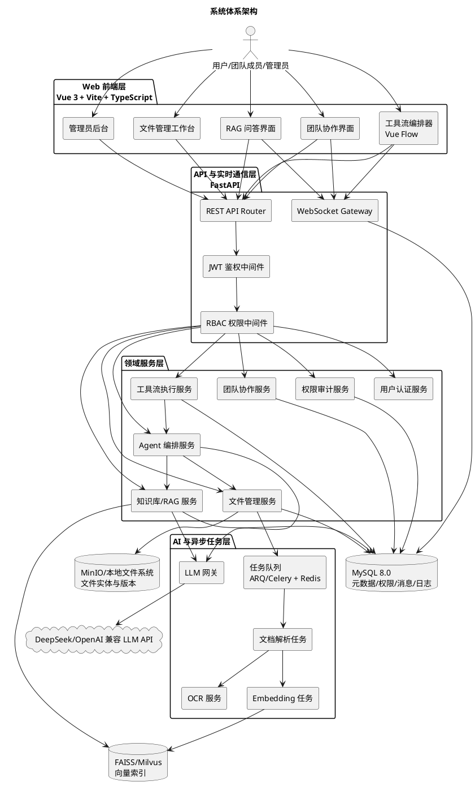
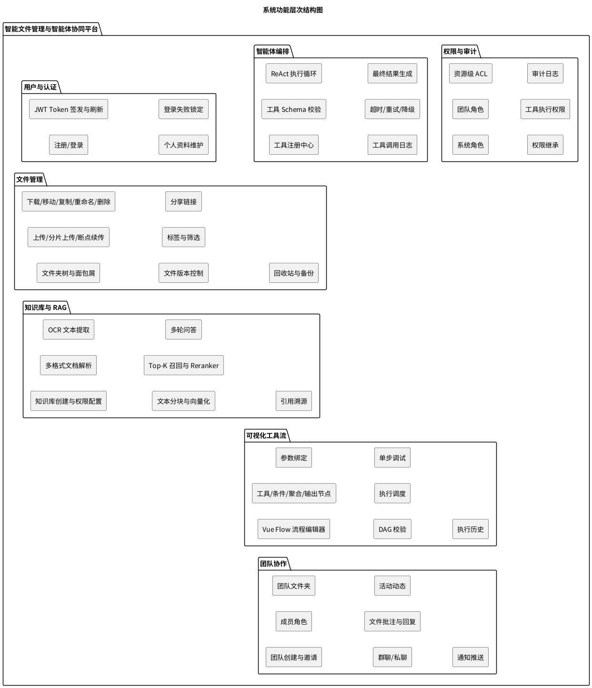
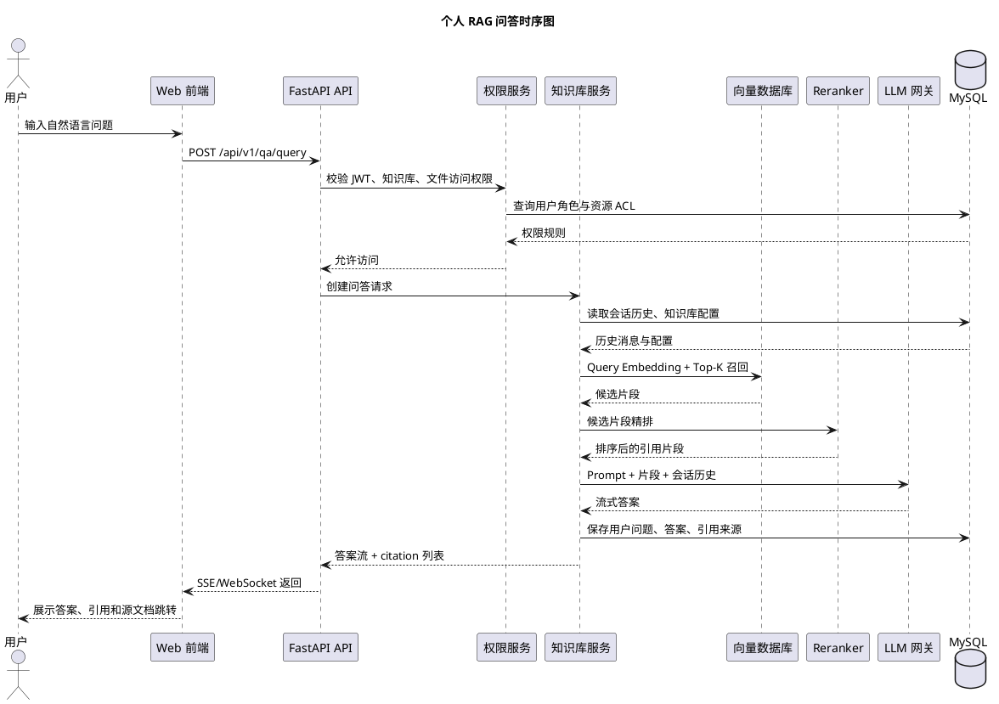
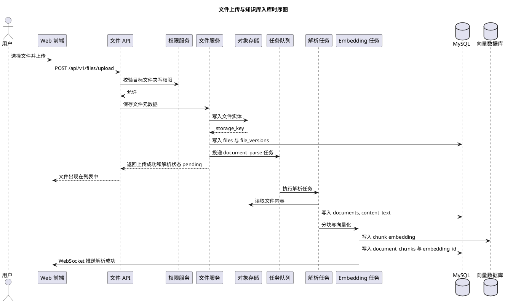
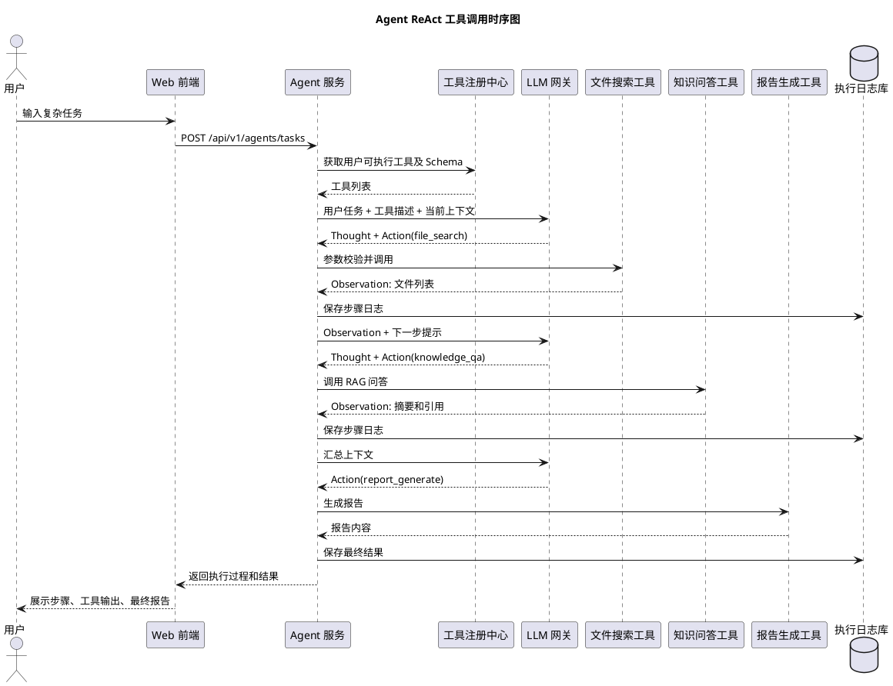
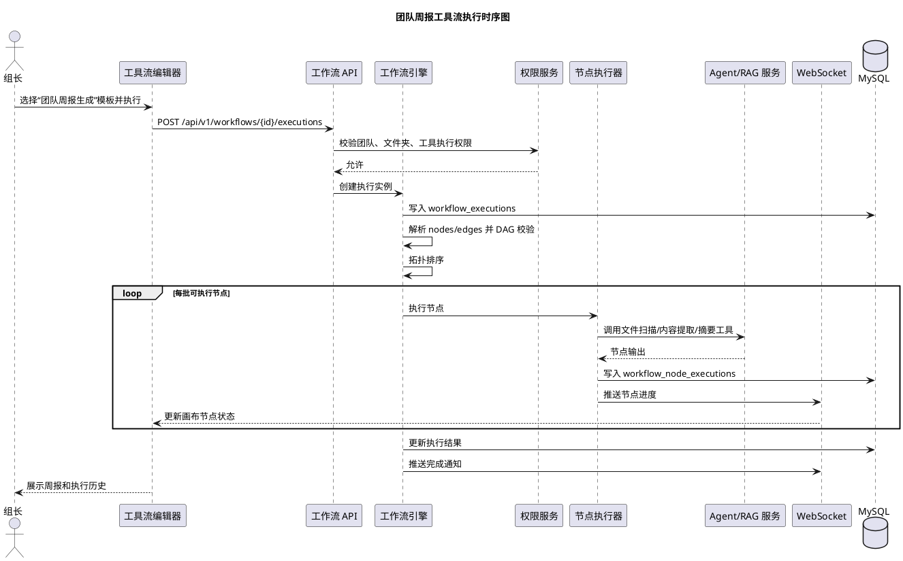
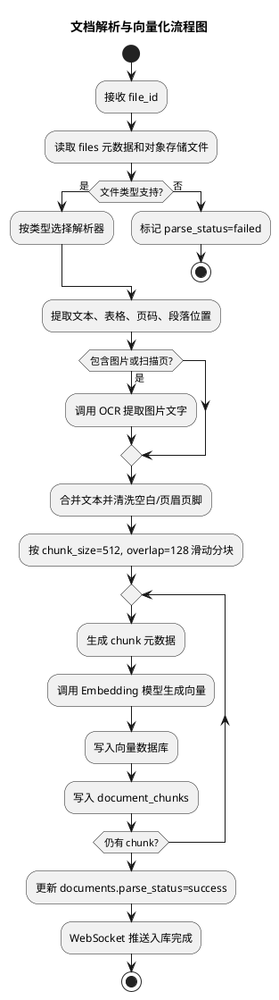
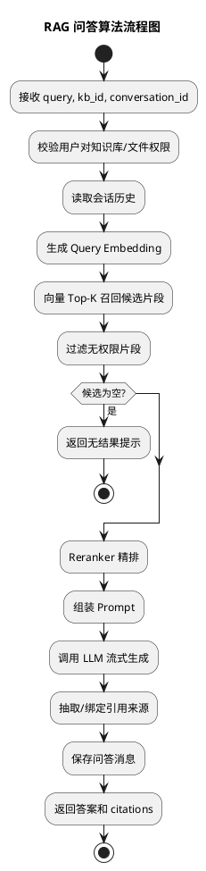
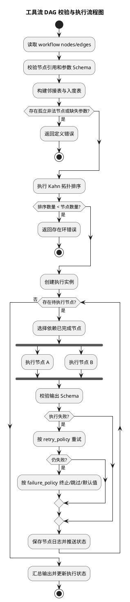
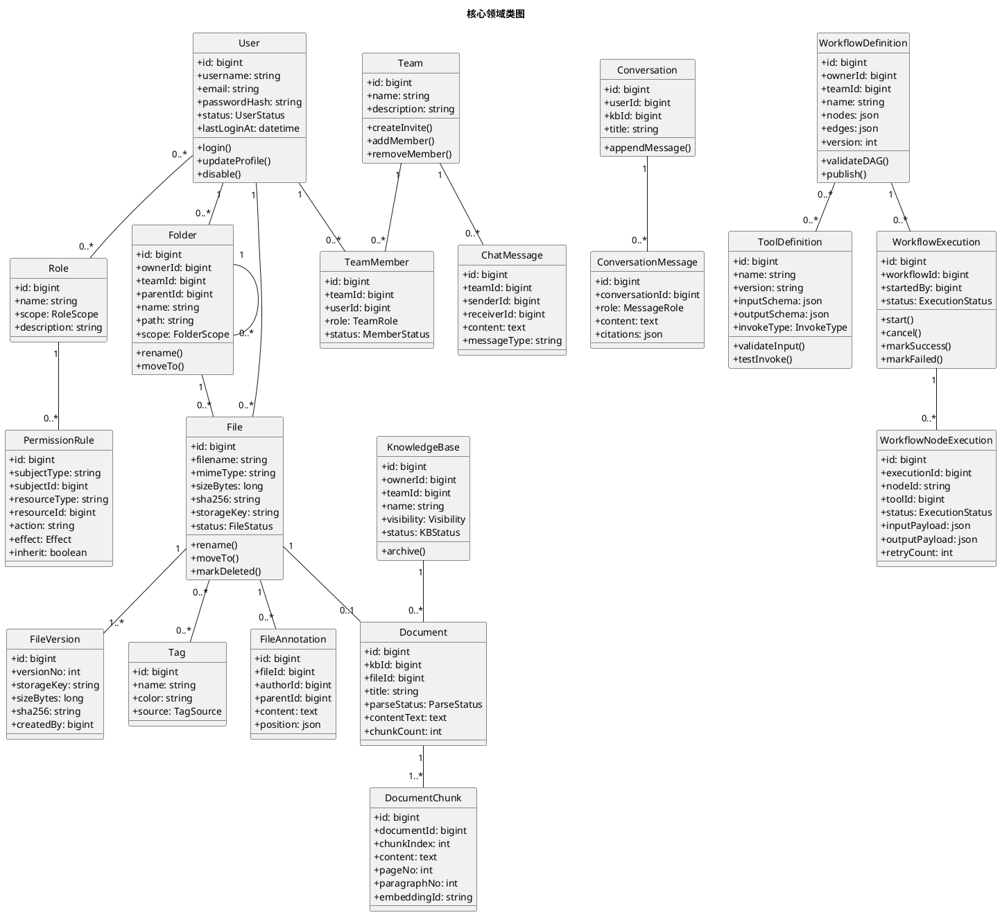

# 基于大模型的智能文件管理与智能体协同平台系统设计说明书

## 1. 引言

### 1.1 编写目的

本文档在《需求规格说明书》和现有 UML/开发计划文档基础上，对“基于大模型的智能文件管理与智能体协同平台”进行系统设计说明。文档面向项目开发、测试、部署和答辩评审，覆盖系统体系架构、功能结构、关键用例时序、复杂算法、类图、接口、数据库物理设计、UI 设计以及前后端依赖库选型。

### 1.3 系统定位

系统以文件管理为基础，以知识检索为能力核心，以智能体和可视化工具流作为自动化执行入口，并通过团队空间、权限和协作机制支撑多人学习、课程小组和科研团队场景。系统不是单纯网盘，也不是单轮 AI 聊天工具，而是面向文件、知识、流程和团队的智能协作平台。

## 2. 系统体系架构

### 2.1 总体架构

系统采用前后端分离、领域模块化、异步任务驱动的架构。前端负责文件工作台、知识问答、流程画布和团队协作界面；后端通过 FastAPI 提供 REST API、WebSocket、异步任务调度和智能体编排；存储层由 MySQL、对象存储、向量索引共同构成。



### 2.2 架构分层说明

| 层次       | 主要职责                                                         | 关键技术                                      |
| ---------- | ---------------------------------------------------------------- | --------------------------------------------- |
| 表现层     | 提供文件、知识库、问答、流程画布、团队协作、后台管理等页面       | Vue 3、TypeScript、Naive UI、Vue Flow、Pinia  |
| API 层     | 暴露 REST API、WebSocket、鉴权、权限检查、请求校验               | FastAPI、Pydantic、JWT                        |
| 领域服务层 | 封装用户、文件、RAG、Agent、工具流、团队、审计等业务逻辑         | Python service 模块、SQLAlchemy               |
| AI 能力层  | 文档解析、OCR、Embedding、语义检索、重排序、LLM 生成、Agent 推理 | LangChain、LangGraph、FAISS/Milvus、PaddleOCR |
| 异步任务层 | 将解析、向量化、工作流执行等耗时任务从请求链路中剥离             | Redis、ARQ/Celery                             |
| 存储层     | 保存元数据、权限、消息、日志、文件实体和向量数据                 | MySQL、MinIO、本地文件系统、FAISS/Milvus      |

### 2.3 关键架构原则

1. **权限前置**：所有文件、知识库、团队、工具和流程资源访问都必须先经过 JWT 和 RBAC 校验。
2. **上传与解析解耦**：文件上传成功后立即返回基础元数据，解析、OCR 和向量化进入异步任务队列。
3. **AI 能力可降级**：LLM、Embedding 或 OCR 不可用时，文件管理、权限、团队协作和已建索引检索仍可使用。
4. **工具可扩展**：工具通过 JSON Schema、调用类型和调用配置注册，不修改 Agent 核心执行器即可增加新工具。
5. **向量库可替换**：MVP 使用 FAISS，本地索引满足轻量部署；数据规模增长后通过统一 VectorStore 接口迁移到 Milvus。

## 3. 系统功能结构

### 3.1 功能层次结构



### 3.2 模块职责划分

| 模块         | 输入                                 | 输出                               | 说明                   |
| ------------ | ------------------------------------ | ---------------------------------- | ---------------------- |
| 用户认证模块 | 注册信息、登录凭证、Refresh Token    | 用户信息、Access Token、权限上下文 | 统一身份入口           |
| 文件管理模块 | 文件实体、文件夹操作、标签、分享配置 | 文件元数据、下载链接、上传状态     | 平台基础数据入口       |
| 知识库模块   | 已上传文件、知识库配置、自然语言问题 | 文档索引、检索片段、问答结果       | 支撑跨文档语义检索     |
| Agent 模块   | 用户复杂任务、工具定义、上下文       | 工具调用步骤、最终答案或报告       | 支撑多步骤任务自动执行 |
| 工具流模块   | 流程节点、连线、参数、触发输入       | 流程执行记录、节点输出、进度事件   | 支撑可视化自动化       |
| 团队协作模块 | 团队、成员、消息、批注、通知事件     | 团队空间、消息流、通知、动态       | 支撑多人协同           |
| 权限审计模块 | 用户身份、资源、动作、操作详情       | 允许/拒绝结果、审计日志            | 横切所有业务模块       |

## 4. 系统用例时序图及说明

### 4.1 个人 RAG 问答时序图



**说明：**

1. 前端提交问题时必须携带 `conversation_id` 或 `kb_id`，后端根据用户身份和资源 ACL 判断是否允许访问。
2. RAG 服务先读取会话历史，再对问题生成向量并从 FAISS/Milvus 召回 Top-K 片段。
3. Reranker 对召回片段进行精排，减少语义召回中的低相关片段。
4. LLM 输出采用流式返回，前端边接收边展示，最终答案保存到 `conversation_messages`。
5. 引用来源以 `document_id`、`chunk_id`、页码、段落位置组成，支持前端跳转源文档。

### 4.2 文件上传与知识库入库时序图



**说明：**

上传主链路只负责权限、存储、元数据和任务投递，不等待文档解析完成。解析失败不会影响文件基础管理，但会将 `documents.parse_status` 标记为 `failed` 并记录错误信息。

### 4.3 Agent ReAct 工具调用时序图



**说明：**

Agent 执行遵循 ReAct 模式：`Thought -> Action -> Observation -> Answer`。每次工具调用前进行 JSON Schema 参数校验、权限校验和超时控制；每次调用结果写入执行日志，便于前端展示和后续审计。

### 4.4 团队周报工具流执行时序图



**说明：**

工作流执行以 DAG 为基本模型。系统先校验流程结构，再按拓扑顺序调度节点；入度为 0 且依赖完成的节点可并行执行。节点状态通过 WebSocket 实时推送，支持失败重试、跳过或终止策略。

## 5. 复杂功能算法设计

### 5.1 文档解析、分块与向量化算法



伪码：

```text
function index_document(file_id, kb_id):
    file = file_repo.get(file_id)
    assert_supported(file.mime_type)

    raw = object_store.read(file.storage_key)
    parsed = parser_factory.for_type(file.mime_type).parse(raw)

    if parsed.has_images:
        ocr_text = ocr.extract(parsed.images)
        parsed.text = merge(parsed.text, ocr_text)

    normalized_text = normalize(parsed.text)
    chunks = sliding_window(normalized_text, chunk_size=512, overlap=128)

    document = document_repo.create(kb_id, file_id, status="processing")
    for index, chunk in enumerate(chunks):
        vector = embedding_model.embed(chunk.content)
        embedding_id = vector_store.upsert(
            vector=vector,
            metadata={
                "file_id": file_id,
                "document_id": document.id,
                "chunk_index": index,
                "page_no": chunk.page_no,
                "paragraph_no": chunk.paragraph_no
            }
        )
        chunk_repo.create(document.id, index, chunk, embedding_id)

    document_repo.mark_success(document.id, chunk_count=len(chunks))
```

### 5.2 RAG 问答算法



伪码：

```text
function answer_question(user, kb_id, conversation_id, query):
    permission.ensure(user, "knowledge_base", kb_id, "read")

    history = conversation_repo.load_window(conversation_id, limit=8)
    query_vector = embedding_model.embed(query)
    candidates = vector_store.search(kb_id, query_vector, top_k=30)

    allowed = []
    for chunk in candidates:
        if permission.can(user, "file", chunk.file_id, "read"):
            allowed.append(chunk)

    if allowed is empty:
        return no_result_answer()

    ranked = reranker.rank(query, allowed)[:8]
    prompt = prompt_builder.build_rag_prompt(query, history, ranked)

    answer_stream = llm.stream(prompt)
    answer = collect_and_forward(answer_stream)
    citations = build_citations(ranked)

    conversation_repo.append_user_message(conversation_id, query)
    conversation_repo.append_assistant_message(conversation_id, answer, citations)
    return answer, citations
```

### 5.3 工具流 DAG 校验与调度算法



伪码：

```text
function run_workflow(workflow_id, input_payload, actor):
    workflow = workflow_repo.get_published(workflow_id)
    permission.ensure(actor, "workflow", workflow_id, "execute")

    graph = parse_graph(workflow.nodes, workflow.edges)
    validate_node_schema(graph.nodes)
    order = topological_sort(graph)
    if len(order) != len(graph.nodes):
        raise WorkflowDefinitionError("workflow graph contains cycle")

    execution = execution_repo.create(workflow_id, actor.id, input_payload)
    context = {"input": input_payload, "nodes": {}}

    ready_batches = build_parallel_batches(order, graph)
    for batch in ready_batches:
        results = parallel_run([
            lambda node: execute_node_with_retry(node, context)
            for node in batch
        ])
        for result in results:
            execution_repo.save_node_result(execution.id, result)
            websocket.publish(actor.id, "workflow.node.updated", result)

            if result.failed and result.failure_policy == "terminate":
                execution_repo.mark_failed(execution.id, result.error)
                return
            context["nodes"][result.node_id] = result.output

    output = aggregate_outputs(context)
    execution_repo.mark_success(execution.id, output)
    websocket.publish(actor.id, "workflow.completed", output)
```

### 5.4 RBAC + ACL 权限判定算法

```text
function can_access(user, resource_type, resource_id, action):
    if user.status != "active":
        return false

    subjects = [
        ("user", user.id),
        ("role", each role id of user),
        ("team", team ids where user is member)
    ]

    resource_chain = build_resource_chain(resource_type, resource_id)
    matched_rules = []
    for resource in resource_chain:
        matched_rules += permission_repo.find(subjects, resource, action)

    if any rule.effect == "deny" in matched_rules:
        return false
    if any rule.effect == "allow" in matched_rules:
        return true

    return default_policy(resource_type, action)
```

权限设计采用“显式拒绝优先、显式允许次之、默认策略兜底”的顺序。文件夹权限可继承到子文件夹和文件，单个资源可设置覆盖规则。

## 6. 面向对象方法类图详细设计

### 6.1 核心领域类图



### 6.2 服务类设计

| 服务类                 | 主要方法                                                               | 说明                        |
| ---------------------- | ---------------------------------------------------------------------- | --------------------------- |
| `AuthService`          | `register()`、`login()`、`refresh_token()`、`hash_password()`          | 用户注册、登录和 Token 管理 |
| `PermissionService`    | `can_access()`、`ensure()`、`grant()`、`revoke()`                      | RBAC/ACL 权限判定           |
| `FileService`          | `upload()`、`download_url()`、`move()`、`rename()`、`create_version()` | 文件生命周期管理            |
| `DocumentParseService` | `parse_file()`、`extract_text()`、`extract_ocr()`                      | 文档解析与 OCR              |
| `EmbeddingService`     | `embed_text()`、`index_chunks()`                                       | 分块向量化与索引写入        |
| `RAGService`           | `retrieve()`、`rerank()`、`answer()`                                   | 检索增强生成                |
| `ToolRegistryService`  | `register_tool()`、`validate_input()`、`invoke()`                      | 工具注册与调用              |
| `AgentService`         | `run_task()`、`run_react_loop()`                                       | 智能体任务编排              |
| `WorkflowService`      | `validate_dag()`、`start_execution()`、`run_node()`                    | 工具流校验与执行            |
| `TeamService`          | `create_team()`、`invite()`、`set_role()`                              | 团队与成员管理              |
| `NotificationService`  | `push()`、`mark_read()`                                                | 通知与 WebSocket 推送       |
| `AuditService`         | `record()`、`query_logs()`                                             | 审计记录与查询              |

## 7. 接口设计

### 7.1 接口规范

- 基础路径：`/api/v1`
- 认证方式：`Authorization: Bearer <access_token>`
- 请求/响应格式：JSON；文件上传使用 `multipart/form-data`
- 时间格式：ISO 8601
- 分页参数：`page`、`page_size`
- 统一错误响应：

```json
{
    "code": "PERMISSION_DENIED",
    "message": "无权访问该资源",
    "detail": {
        "resource_type": "file",
        "resource_id": 1001
    }
}
```

### 7.2 用户认证接口

| 方法    | 路径             | 说明                                         |
| ------- | ---------------- | -------------------------------------------- |
| `POST`  | `/auth/register` | 用户注册                                     |
| `POST`  | `/auth/login`    | 用户登录，返回 Access Token 和 Refresh Token |
| `POST`  | `/auth/refresh`  | 刷新 Access Token                            |
| `GET`   | `/users/me`      | 获取当前用户信息                             |
| `PATCH` | `/users/me`      | 修改个人资料                                 |

登录响应示例：

```json
{
    "access_token": "jwt-access-token",
    "refresh_token": "jwt-refresh-token",
    "token_type": "bearer",
    "expires_in": 1800,
    "user": {
        "id": 1,
        "username": "xiaoming",
        "email": "xiaoming@example.com"
    }
}
```

### 7.3 文件管理接口

| 方法     | 路径                                             | 说明                   |
| -------- | ------------------------------------------------ | ---------------------- |
| `GET`    | `/folders/tree`                                  | 获取个人或团队文件夹树 |
| `POST`   | `/folders`                                       | 创建文件夹             |
| `PATCH`  | `/folders/{folder_id}`                           | 重命名或移动文件夹     |
| `DELETE` | `/folders/{folder_id}`                           | 删除文件夹             |
| `GET`    | `/files`                                         | 文件列表、搜索和筛选   |
| `POST`   | `/files/upload`                                  | 上传文件               |
| `POST`   | `/files/chunk/init`                              | 初始化分片上传         |
| `PUT`    | `/files/chunk/{upload_id}/{part_no}`             | 上传分片               |
| `POST`   | `/files/chunk/{upload_id}/complete`              | 合并分片               |
| `GET`    | `/files/{file_id}/download-url`                  | 获取短期下载链接       |
| `PATCH`  | `/files/{file_id}`                               | 重命名、移动或修改标签 |
| `DELETE` | `/files/{file_id}`                               | 软删除文件             |
| `GET`    | `/files/{file_id}/versions`                      | 查询文件版本           |
| `POST`   | `/files/{file_id}/versions/{version_id}/restore` | 回滚版本               |
| `POST`   | `/files/{file_id}/share-links`                   | 创建分享链接           |

### 7.4 知识库与 RAG 接口

| 方法    | 路径                                        | 说明             |
| ------- | ------------------------------------------- | ---------------- |
| `GET`   | `/knowledge-bases`                          | 查询知识库       |
| `POST`  | `/knowledge-bases`                          | 创建知识库       |
| `PATCH` | `/knowledge-bases/{kb_id}`                  | 修改知识库       |
| `POST`  | `/knowledge-bases/{kb_id}/documents`        | 将文件加入知识库 |
| `GET`   | `/knowledge-bases/{kb_id}/documents`        | 查询知识库文档   |
| `POST`  | `/documents/{document_id}/reparse`          | 重新解析文档     |
| `POST`  | `/qa/query`                                 | 发起知识库问答   |
| `GET`   | `/conversations`                            | 查询会话列表     |
| `GET`   | `/conversations/{conversation_id}/messages` | 查询会话消息     |

问答请求示例：

```json
{
    "kb_id": 10,
    "conversation_id": 21,
    "question": "总结所有用到显微镜的实验步骤",
    "top_k": 8,
    "stream": true
}
```

问答响应事件示例：

```json
{
    "event": "answer.delta",
    "content": "显微镜相关实验步骤包括..."
}
```

```json
{
    "event": "answer.completed",
    "message_id": 301,
    "citations": [
        {
            "file_id": 1001,
            "document_id": 201,
            "chunk_id": 9001,
            "title": "生物实验报告.pdf",
            "page_no": 3,
            "paragraph_no": 5
        }
    ]
}
```

### 7.5 Agent 与工具接口

| 方法    | 路径                             | 说明                   |
| ------- | -------------------------------- | ---------------------- |
| `GET`   | `/tools`                         | 查询可用工具           |
| `POST`  | `/admin/tools`                   | 管理员注册工具         |
| `POST`  | `/admin/tools/{tool_id}/test`    | 工具测试调用           |
| `PATCH` | `/admin/tools/{tool_id}`         | 修改工具定义或状态     |
| `POST`  | `/agents/tasks`                  | 创建智能体任务         |
| `GET`   | `/agents/tasks/{task_id}`        | 查询任务状态和执行步骤 |
| `POST`  | `/agents/tasks/{task_id}/cancel` | 取消任务               |

工具定义示例：

```json
{
    "name": "knowledge_qa",
    "version": "1.0.0",
    "category": "AI处理",
    "input_schema": {
        "type": "object",
        "required": ["kb_id", "question"],
        "properties": {
            "kb_id": { "type": "integer" },
            "question": { "type": "string" }
        }
    },
    "output_schema": {
        "type": "object",
        "properties": {
            "answer": { "type": "string" },
            "citations": { "type": "array" }
        }
    },
    "invoke_type": "python",
    "invoke_config": {
        "module": "app.tools.knowledge_qa",
        "function": "run"
    }
}
```

### 7.6 工具流接口

| 方法    | 路径                                         | 说明            |
| ------- | -------------------------------------------- | --------------- |
| `GET`   | `/workflows`                                 | 查询流程定义    |
| `POST`  | `/workflows`                                 | 创建流程        |
| `PATCH` | `/workflows/{workflow_id}`                   | 修改流程        |
| `POST`  | `/workflows/{workflow_id}/validate`          | 校验 DAG 和参数 |
| `POST`  | `/workflows/{workflow_id}/publish`           | 发布流程        |
| `POST`  | `/workflows/{workflow_id}/executions`        | 执行流程        |
| `GET`   | `/workflow-executions/{execution_id}`        | 查询执行详情    |
| `POST`  | `/workflow-executions/{execution_id}/cancel` | 取消执行        |

WebSocket 事件：

| 事件                    | 说明         |
| ----------------------- | ------------ |
| `workflow.started`      | 流程开始     |
| `workflow.node.running` | 节点开始执行 |
| `workflow.node.success` | 节点成功     |
| `workflow.node.failed`  | 节点失败     |
| `workflow.completed`    | 流程完成     |
| `workflow.failed`       | 流程失败     |

### 7.7 团队协作接口

| 方法     | 路径                                    | 说明           |
| -------- | --------------------------------------- | -------------- |
| `POST`   | `/teams`                                | 创建团队       |
| `GET`    | `/teams`                                | 查询我的团队   |
| `POST`   | `/teams/{team_id}/invites`              | 创建邀请       |
| `POST`   | `/teams/{team_id}/members`              | 加入或添加成员 |
| `PATCH`  | `/teams/{team_id}/members/{member_id}`  | 修改成员角色   |
| `DELETE` | `/teams/{team_id}/members/{member_id}`  | 移除成员       |
| `GET`    | `/teams/{team_id}/messages`             | 查询聊天历史   |
| `POST`   | `/teams/{team_id}/messages`             | 发送消息       |
| `GET`    | `/files/{file_id}/annotations`          | 查询文件批注   |
| `POST`   | `/files/{file_id}/annotations`          | 创建批注       |
| `POST`   | `/annotations/{annotation_id}/replies`  | 回复批注       |
| `GET`    | `/notifications`                        | 查询通知       |
| `PATCH`  | `/notifications/{notification_id}/read` | 标记已读       |

### 7.8 权限与审计接口

| 方法     | 路径                           | 说明         |
| -------- | ------------------------------ | ------------ |
| `GET`    | `/permissions/rules`           | 查询权限规则 |
| `POST`   | `/permissions/rules`           | 创建授权规则 |
| `DELETE` | `/permissions/rules/{rule_id}` | 删除授权规则 |
| `GET`    | `/audit-logs`                  | 查询审计日志 |

## 8. 数据库物理设计

### 8.1 设计约定

- 数据库：MySQL 8.0
- 字符集：`utf8mb4`
- 排序规则：`utf8mb4_0900_ai_ci`
- 主键：`BIGINT UNSIGNED AUTO_INCREMENT`
- 时间字段：`DATETIME(3)`，统一存储服务器时间或 UTC
- JSON 字段：使用 MySQL `JSON` 类型保存 Schema、流程节点、引用来源和执行输入输出
- 删除策略：业务数据优先软删除，审计日志只追加不更新

### 8.2 核心物理表

#### 8.2.1 用户与权限域

```sql
CREATE TABLE users (
  id BIGINT UNSIGNED PRIMARY KEY AUTO_INCREMENT,
  username VARCHAR(64) NOT NULL UNIQUE,
  email VARCHAR(128) NOT NULL UNIQUE,
  password_hash VARCHAR(255) NOT NULL,
  role_type VARCHAR(32) NOT NULL DEFAULT 'user',
  status VARCHAR(32) NOT NULL DEFAULT 'active',
  last_login_at DATETIME(3) NULL,
  created_at DATETIME(3) NOT NULL DEFAULT CURRENT_TIMESTAMP(3),
  updated_at DATETIME(3) NOT NULL DEFAULT CURRENT_TIMESTAMP(3) ON UPDATE CURRENT_TIMESTAMP(3),
  INDEX idx_users_status (status)
) ENGINE=InnoDB DEFAULT CHARSET=utf8mb4;

CREATE TABLE roles (
  id BIGINT UNSIGNED PRIMARY KEY AUTO_INCREMENT,
  name VARCHAR(64) NOT NULL,
  scope VARCHAR(32) NOT NULL,
  description VARCHAR(255) NULL,
  created_at DATETIME(3) NOT NULL DEFAULT CURRENT_TIMESTAMP(3),
  UNIQUE KEY uk_roles_name_scope (name, scope)
) ENGINE=InnoDB DEFAULT CHARSET=utf8mb4;

CREATE TABLE user_roles (
  id BIGINT UNSIGNED PRIMARY KEY AUTO_INCREMENT,
  user_id BIGINT UNSIGNED NOT NULL,
  role_id BIGINT UNSIGNED NOT NULL,
  created_at DATETIME(3) NOT NULL DEFAULT CURRENT_TIMESTAMP(3),
  UNIQUE KEY uk_user_roles (user_id, role_id),
  CONSTRAINT fk_user_roles_user FOREIGN KEY (user_id) REFERENCES users(id),
  CONSTRAINT fk_user_roles_role FOREIGN KEY (role_id) REFERENCES roles(id)
) ENGINE=InnoDB DEFAULT CHARSET=utf8mb4;

CREATE TABLE permission_rules (
  id BIGINT UNSIGNED PRIMARY KEY AUTO_INCREMENT,
  subject_type VARCHAR(32) NOT NULL,
  subject_id BIGINT UNSIGNED NOT NULL,
  resource_type VARCHAR(32) NOT NULL,
  resource_id BIGINT UNSIGNED NOT NULL,
  action VARCHAR(32) NOT NULL,
  effect VARCHAR(16) NOT NULL,
  inherit BOOLEAN NOT NULL DEFAULT TRUE,
  created_at DATETIME(3) NOT NULL DEFAULT CURRENT_TIMESTAMP(3),
  INDEX idx_perm_subject (subject_type, subject_id),
  INDEX idx_perm_resource (resource_type, resource_id),
  INDEX idx_perm_action (action)
) ENGINE=InnoDB DEFAULT CHARSET=utf8mb4;
```

#### 8.2.2 文件管理域

```sql
CREATE TABLE folders (
  id BIGINT UNSIGNED PRIMARY KEY AUTO_INCREMENT,
  owner_id BIGINT UNSIGNED NULL,
  team_id BIGINT UNSIGNED NULL,
  parent_id BIGINT UNSIGNED NULL,
  name VARCHAR(128) NOT NULL,
  path VARCHAR(1024) NOT NULL,
  scope VARCHAR(32) NOT NULL,
  created_at DATETIME(3) NOT NULL DEFAULT CURRENT_TIMESTAMP(3),
  updated_at DATETIME(3) NOT NULL DEFAULT CURRENT_TIMESTAMP(3) ON UPDATE CURRENT_TIMESTAMP(3),
  INDEX idx_folders_owner_parent (owner_id, parent_id),
  INDEX idx_folders_team_parent (team_id, parent_id),
  CONSTRAINT fk_folders_parent FOREIGN KEY (parent_id) REFERENCES folders(id)
) ENGINE=InnoDB DEFAULT CHARSET=utf8mb4;

CREATE TABLE files (
  id BIGINT UNSIGNED PRIMARY KEY AUTO_INCREMENT,
  owner_id BIGINT UNSIGNED NULL,
  team_id BIGINT UNSIGNED NULL,
  folder_id BIGINT UNSIGNED NOT NULL,
  filename VARCHAR(255) NOT NULL,
  extension VARCHAR(32) NULL,
  mime_type VARCHAR(128) NOT NULL,
  size_bytes BIGINT UNSIGNED NOT NULL,
  sha256 CHAR(64) NOT NULL,
  storage_key VARCHAR(512) NOT NULL,
  status VARCHAR(32) NOT NULL DEFAULT 'active',
  sensitive BOOLEAN NOT NULL DEFAULT FALSE,
  created_at DATETIME(3) NOT NULL DEFAULT CURRENT_TIMESTAMP(3),
  updated_at DATETIME(3) NOT NULL DEFAULT CURRENT_TIMESTAMP(3) ON UPDATE CURRENT_TIMESTAMP(3),
  FULLTEXT KEY ft_files_filename (filename),
  INDEX idx_files_folder (folder_id),
  INDEX idx_files_owner_status (owner_id, status),
  INDEX idx_files_team_status (team_id, status),
  INDEX idx_files_sha256 (sha256),
  CONSTRAINT fk_files_folder FOREIGN KEY (folder_id) REFERENCES folders(id)
) ENGINE=InnoDB DEFAULT CHARSET=utf8mb4;

CREATE TABLE file_versions (
  id BIGINT UNSIGNED PRIMARY KEY AUTO_INCREMENT,
  file_id BIGINT UNSIGNED NOT NULL,
  version_no INT NOT NULL,
  storage_key VARCHAR(512) NOT NULL,
  size_bytes BIGINT UNSIGNED NOT NULL,
  sha256 CHAR(64) NOT NULL,
  created_by BIGINT UNSIGNED NOT NULL,
  created_at DATETIME(3) NOT NULL DEFAULT CURRENT_TIMESTAMP(3),
  UNIQUE KEY uk_file_versions (file_id, version_no),
  CONSTRAINT fk_file_versions_file FOREIGN KEY (file_id) REFERENCES files(id),
  CONSTRAINT fk_file_versions_user FOREIGN KEY (created_by) REFERENCES users(id)
) ENGINE=InnoDB DEFAULT CHARSET=utf8mb4;

CREATE TABLE tags (
  id BIGINT UNSIGNED PRIMARY KEY AUTO_INCREMENT,
  owner_id BIGINT UNSIGNED NULL,
  name VARCHAR(64) NOT NULL,
  color VARCHAR(16) NULL,
  source VARCHAR(32) NOT NULL DEFAULT 'manual',
  created_at DATETIME(3) NOT NULL DEFAULT CURRENT_TIMESTAMP(3),
  UNIQUE KEY uk_tags_owner_name (owner_id, name)
) ENGINE=InnoDB DEFAULT CHARSET=utf8mb4;

CREATE TABLE file_tags (
  id BIGINT UNSIGNED PRIMARY KEY AUTO_INCREMENT,
  file_id BIGINT UNSIGNED NOT NULL,
  tag_id BIGINT UNSIGNED NOT NULL,
  created_at DATETIME(3) NOT NULL DEFAULT CURRENT_TIMESTAMP(3),
  UNIQUE KEY uk_file_tags (file_id, tag_id),
  CONSTRAINT fk_file_tags_file FOREIGN KEY (file_id) REFERENCES files(id),
  CONSTRAINT fk_file_tags_tag FOREIGN KEY (tag_id) REFERENCES tags(id)
) ENGINE=InnoDB DEFAULT CHARSET=utf8mb4;
```

#### 8.2.3 知识库与问答域

```sql
CREATE TABLE knowledge_bases (
  id BIGINT UNSIGNED PRIMARY KEY AUTO_INCREMENT,
  owner_id BIGINT UNSIGNED NOT NULL,
  team_id BIGINT UNSIGNED NULL,
  name VARCHAR(128) NOT NULL,
  description TEXT NULL,
  visibility VARCHAR(32) NOT NULL DEFAULT 'private',
  status VARCHAR(32) NOT NULL DEFAULT 'active',
  created_at DATETIME(3) NOT NULL DEFAULT CURRENT_TIMESTAMP(3),
  updated_at DATETIME(3) NOT NULL DEFAULT CURRENT_TIMESTAMP(3) ON UPDATE CURRENT_TIMESTAMP(3),
  INDEX idx_kb_owner (owner_id),
  INDEX idx_kb_team (team_id),
  CONSTRAINT fk_kb_owner FOREIGN KEY (owner_id) REFERENCES users(id)
) ENGINE=InnoDB DEFAULT CHARSET=utf8mb4;

CREATE TABLE documents (
  id BIGINT UNSIGNED PRIMARY KEY AUTO_INCREMENT,
  kb_id BIGINT UNSIGNED NOT NULL,
  file_id BIGINT UNSIGNED NOT NULL,
  title VARCHAR(255) NOT NULL,
  parse_status VARCHAR(32) NOT NULL DEFAULT 'pending',
  content_text LONGTEXT NULL,
  chunk_count INT NOT NULL DEFAULT 0,
  parser_version VARCHAR(32) NULL,
  parsed_at DATETIME(3) NULL,
  created_at DATETIME(3) NOT NULL DEFAULT CURRENT_TIMESTAMP(3),
  INDEX idx_documents_kb (kb_id),
  INDEX idx_documents_file (file_id),
  INDEX idx_documents_status (parse_status),
  CONSTRAINT fk_documents_kb FOREIGN KEY (kb_id) REFERENCES knowledge_bases(id),
  CONSTRAINT fk_documents_file FOREIGN KEY (file_id) REFERENCES files(id)
) ENGINE=InnoDB DEFAULT CHARSET=utf8mb4;

CREATE TABLE document_chunks (
  id BIGINT UNSIGNED PRIMARY KEY AUTO_INCREMENT,
  document_id BIGINT UNSIGNED NOT NULL,
  chunk_index INT NOT NULL,
  content TEXT NOT NULL,
  page_no INT NULL,
  paragraph_no INT NULL,
  start_offset INT NULL,
  end_offset INT NULL,
  embedding_id VARCHAR(128) NOT NULL,
  created_at DATETIME(3) NOT NULL DEFAULT CURRENT_TIMESTAMP(3),
  UNIQUE KEY uk_document_chunk (document_id, chunk_index),
  INDEX idx_chunks_embedding (embedding_id),
  CONSTRAINT fk_chunks_document FOREIGN KEY (document_id) REFERENCES documents(id)
) ENGINE=InnoDB DEFAULT CHARSET=utf8mb4;

CREATE TABLE conversations (
  id BIGINT UNSIGNED PRIMARY KEY AUTO_INCREMENT,
  user_id BIGINT UNSIGNED NOT NULL,
  kb_id BIGINT UNSIGNED NULL,
  title VARCHAR(255) NULL,
  created_at DATETIME(3) NOT NULL DEFAULT CURRENT_TIMESTAMP(3),
  updated_at DATETIME(3) NOT NULL DEFAULT CURRENT_TIMESTAMP(3) ON UPDATE CURRENT_TIMESTAMP(3),
  INDEX idx_conversations_user (user_id),
  INDEX idx_conversations_kb (kb_id),
  CONSTRAINT fk_conversations_user FOREIGN KEY (user_id) REFERENCES users(id)
) ENGINE=InnoDB DEFAULT CHARSET=utf8mb4;

CREATE TABLE conversation_messages (
  id BIGINT UNSIGNED PRIMARY KEY AUTO_INCREMENT,
  conversation_id BIGINT UNSIGNED NOT NULL,
  role VARCHAR(32) NOT NULL,
  content LONGTEXT NOT NULL,
  citations JSON NULL,
  token_count INT NULL,
  created_at DATETIME(3) NOT NULL DEFAULT CURRENT_TIMESTAMP(3),
  INDEX idx_messages_conversation_time (conversation_id, created_at),
  CONSTRAINT fk_messages_conversation FOREIGN KEY (conversation_id) REFERENCES conversations(id)
) ENGINE=InnoDB DEFAULT CHARSET=utf8mb4;
```

#### 8.2.4 工具流与团队协作域

```sql
CREATE TABLE tool_definitions (
  id BIGINT UNSIGNED PRIMARY KEY AUTO_INCREMENT,
  name VARCHAR(128) NOT NULL,
  version VARCHAR(32) NOT NULL,
  category VARCHAR(64) NOT NULL,
  description TEXT NULL,
  input_schema JSON NOT NULL,
  output_schema JSON NOT NULL,
  invoke_type VARCHAR(32) NOT NULL,
  invoke_config JSON NOT NULL,
  timeout_seconds INT NOT NULL DEFAULT 30,
  status VARCHAR(32) NOT NULL DEFAULT 'draft',
  created_by BIGINT UNSIGNED NOT NULL,
  created_at DATETIME(3) NOT NULL DEFAULT CURRENT_TIMESTAMP(3),
  UNIQUE KEY uk_tool_name_version (name, version),
  INDEX idx_tools_status (status),
  CONSTRAINT fk_tools_creator FOREIGN KEY (created_by) REFERENCES users(id)
) ENGINE=InnoDB DEFAULT CHARSET=utf8mb4;

CREATE TABLE workflow_definitions (
  id BIGINT UNSIGNED PRIMARY KEY AUTO_INCREMENT,
  owner_id BIGINT UNSIGNED NOT NULL,
  team_id BIGINT UNSIGNED NULL,
  name VARCHAR(128) NOT NULL,
  description TEXT NULL,
  nodes JSON NOT NULL,
  edges JSON NOT NULL,
  trigger_type VARCHAR(32) NOT NULL DEFAULT 'manual',
  version INT NOT NULL DEFAULT 1,
  status VARCHAR(32) NOT NULL DEFAULT 'draft',
  created_at DATETIME(3) NOT NULL DEFAULT CURRENT_TIMESTAMP(3),
  updated_at DATETIME(3) NOT NULL DEFAULT CURRENT_TIMESTAMP(3) ON UPDATE CURRENT_TIMESTAMP(3),
  INDEX idx_workflows_owner (owner_id),
  INDEX idx_workflows_team (team_id),
  CONSTRAINT fk_workflows_owner FOREIGN KEY (owner_id) REFERENCES users(id)
) ENGINE=InnoDB DEFAULT CHARSET=utf8mb4;

CREATE TABLE workflow_executions (
  id BIGINT UNSIGNED PRIMARY KEY AUTO_INCREMENT,
  workflow_id BIGINT UNSIGNED NOT NULL,
  started_by BIGINT UNSIGNED NOT NULL,
  status VARCHAR(32) NOT NULL DEFAULT 'pending',
  input_payload JSON NULL,
  output_payload JSON NULL,
  error_message TEXT NULL,
  started_at DATETIME(3) NOT NULL DEFAULT CURRENT_TIMESTAMP(3),
  ended_at DATETIME(3) NULL,
  INDEX idx_exec_workflow (workflow_id),
  INDEX idx_exec_user_status (started_by, status),
  CONSTRAINT fk_exec_workflow FOREIGN KEY (workflow_id) REFERENCES workflow_definitions(id),
  CONSTRAINT fk_exec_user FOREIGN KEY (started_by) REFERENCES users(id)
) ENGINE=InnoDB DEFAULT CHARSET=utf8mb4;

CREATE TABLE workflow_node_executions (
  id BIGINT UNSIGNED PRIMARY KEY AUTO_INCREMENT,
  execution_id BIGINT UNSIGNED NOT NULL,
  node_id VARCHAR(64) NOT NULL,
  tool_id BIGINT UNSIGNED NULL,
  status VARCHAR(32) NOT NULL DEFAULT 'pending',
  input_payload JSON NULL,
  output_payload JSON NULL,
  retry_count INT NOT NULL DEFAULT 0,
  error_message TEXT NULL,
  started_at DATETIME(3) NULL,
  ended_at DATETIME(3) NULL,
  INDEX idx_node_exec (execution_id, node_id),
  CONSTRAINT fk_node_exec_execution FOREIGN KEY (execution_id) REFERENCES workflow_executions(id),
  CONSTRAINT fk_node_exec_tool FOREIGN KEY (tool_id) REFERENCES tool_definitions(id)
) ENGINE=InnoDB DEFAULT CHARSET=utf8mb4;

CREATE TABLE teams (
  id BIGINT UNSIGNED PRIMARY KEY AUTO_INCREMENT,
  name VARCHAR(128) NOT NULL,
  description TEXT NULL,
  created_by BIGINT UNSIGNED NOT NULL,
  created_at DATETIME(3) NOT NULL DEFAULT CURRENT_TIMESTAMP(3),
  updated_at DATETIME(3) NOT NULL DEFAULT CURRENT_TIMESTAMP(3) ON UPDATE CURRENT_TIMESTAMP(3),
  CONSTRAINT fk_teams_creator FOREIGN KEY (created_by) REFERENCES users(id)
) ENGINE=InnoDB DEFAULT CHARSET=utf8mb4;

CREATE TABLE team_members (
  id BIGINT UNSIGNED PRIMARY KEY AUTO_INCREMENT,
  team_id BIGINT UNSIGNED NOT NULL,
  user_id BIGINT UNSIGNED NOT NULL,
  role VARCHAR(32) NOT NULL DEFAULT 'member',
  status VARCHAR(32) NOT NULL DEFAULT 'active',
  joined_at DATETIME(3) NULL,
  UNIQUE KEY uk_team_member (team_id, user_id),
  CONSTRAINT fk_team_members_team FOREIGN KEY (team_id) REFERENCES teams(id),
  CONSTRAINT fk_team_members_user FOREIGN KEY (user_id) REFERENCES users(id)
) ENGINE=InnoDB DEFAULT CHARSET=utf8mb4;

CREATE TABLE chat_messages (
  id BIGINT UNSIGNED PRIMARY KEY AUTO_INCREMENT,
  team_id BIGINT UNSIGNED NOT NULL,
  sender_id BIGINT UNSIGNED NOT NULL,
  receiver_id BIGINT UNSIGNED NULL,
  content TEXT NOT NULL,
  message_type VARCHAR(32) NOT NULL DEFAULT 'text',
  created_at DATETIME(3) NOT NULL DEFAULT CURRENT_TIMESTAMP(3),
  INDEX idx_chat_team_time (team_id, created_at),
  CONSTRAINT fk_chat_team FOREIGN KEY (team_id) REFERENCES teams(id),
  CONSTRAINT fk_chat_sender FOREIGN KEY (sender_id) REFERENCES users(id)
) ENGINE=InnoDB DEFAULT CHARSET=utf8mb4;
```

### 8.3 向量索引物理设计

FAISS/Milvus 中每个向量保存以下 metadata：

| 字段               | 说明                                              |
| ------------------ | ------------------------------------------------- |
| `embedding_id`     | 向量唯一编号，对应 `document_chunks.embedding_id` |
| `kb_id`            | 知识库编号                                        |
| `file_id`          | 文件编号                                          |
| `document_id`      | 文档编号                                          |
| `chunk_id`         | 分块编号                                          |
| `chunk_index`      | 分块序号                                          |
| `page_no`          | 页码                                              |
| `paragraph_no`     | 段落号                                            |
| `visibility_scope` | private/team/public                               |

FAISS 本地部署时，索引文件建议按知识库拆分：

```text
storage/vector_indexes/
+-- kb_10.index
+-- kb_10.meta.json
+-- kb_11.index
+-- kb_11.meta.json
```

## 9. UI 界面设计

### 9.1 设计原则

界面遵循根目录 `DESIGN.md` 的项目设计系统：安静、学术、操作型、信息密度适中。系统首屏应是可工作的知识工作台，不设计营销型首页。颜色以 `#F6F8FB` 背景、白色操作面板、`#246BFE` 主色、绿色/黄色/红色状态色和少量紫色 AI 标识构成。

### 9.2 整体布局

```text
+--------------------------------------------------------------+
| 顶部栏：当前空间 / 搜索 / 通知 / 用户菜单                    |
+---------------+------------------------------+---------------+
| 左侧导航      | 主工作区                     | 右侧上下文面板 |
| - 个人文件    | - 文件表格/知识库/流程画布   | - RAG 问答    |
| - 团队空间    | - 批量操作工具条             | - 引用来源    |
| - 知识库      | - 状态/筛选/分页             | - 执行步骤    |
| - 工具流      |                              | - 文件详情    |
| - 管理后台    |                              |               |
+---------------+------------------------------+---------------+
```

### 9.3 主要页面设计

#### 9.3.1 文件管理工作台

- 左侧：个人空间/团队空间文件夹树。
- 顶部：面包屑、上传按钮、新建文件夹、搜索框、类型/标签/时间筛选。
- 中间：文件表格，列包括文件名、类型、大小、解析状态、标签、更新时间、权限范围。
- 右侧：文件详情抽屉，展示元数据、版本、分享链接、解析状态和关联知识库。
- 状态：`解析中`、`已入库`、`解析失败`、`无权限` 使用稳定宽度状态标签。

#### 9.3.2 RAG 知识问答界面

- 左侧：知识库列表和文档范围选择。
- 中间：对话流，答案采用流式显示。
- 右侧：引用来源列表，显示文档名、页码、段落和可信片段预览。
- 交互：点击引用跳转文件预览对应页码；无权限引用不展示正文，只显示权限提示。

#### 9.3.3 工具流编排页面

- 中间大区域：Vue Flow 画布，显示工具节点、条件节点、聚合节点、输出节点。
- 左侧：工具市场面板，按文件操作、AI 处理、数据分析、通知类分组。
- 右侧：节点配置抽屉，显示参数 Schema 表单、上游输出绑定和失败策略。
- 底部：执行历史和节点日志表格。
- WebSocket 状态：节点边框和状态徽标实时更新，失败节点可查看错误详情并重试。

#### 9.3.4 Agent 执行面板

- 输入区：自然语言任务输入与上下文文件/知识库选择。
- 执行区：按时间线展示 Thought 摘要、Action 工具名、Observation 结果摘要。
- 结果区：最终答案、报告或导出文件。
- 审计信息：展示任务 ID、发起人、执行耗时、工具调用次数。

#### 9.3.5 团队协作页面

- 左侧：团队列表、成员和角色。
- 中间：团队文件夹与活动动态。
- 右侧：团队聊天、通知、文件批注。
- 成员管理：团队管理员可邀请、移除成员和修改角色；普通成员只可查看成员列表。

#### 9.3.6 管理后台

- 用户管理：用户列表、状态、角色分配。
- 工具管理：工具 Schema 编辑、测试调用、版本和权限配置。
- 权限管理：资源 ACL、继承状态和覆盖规则。
- 审计日志：按用户、资源、动作、时间过滤。

### 9.4 响应式设计

| 视口                | 设计                                                   |
| ------------------- | ------------------------------------------------------ |
| 桌面端 `>=1200px`   | 左侧导航 + 主工作区 + 右侧上下文面板三栏布局           |
| 平板 `768px-1199px` | 左侧导航收起为图标栏，右侧面板改为覆盖式抽屉           |
| 手机 `<768px`       | 单列布局，文件表格变为分组列表，筛选和详情使用全屏抽屉 |

### 9.5 可访问性和安全渲染

1. 所有图标按钮必须提供 tooltip 或 `aria-label`。
2. 文件名、聊天消息、批注、工具描述等用户输入在渲染时必须转义。
3. 主操作按钮有明确可见焦点态。
4. 状态变化通过文本和颜色共同表达，避免仅依赖颜色。
5. 长文件名、长标签、长错误消息必须省略或换行，不撑破布局。

## 11. 非功能设计

### 11.1 性能设计

- 文件列表、搜索、权限校验等普通 API 目标平均响应时间不超过 500ms。
- 上传完成后异步解析，避免 OCR 和 Embedding 阻塞上传请求。
- RAG 问答采用流式输出，首字响应时间目标不超过 5s。
- WebSocket 消息端到端延迟目标不超过 500ms。
- 工具默认超时时间 30s，超时后按节点策略重试或降级。

### 11.2 安全设计

- 密码使用 bcrypt 哈希，禁止明文存储。
- 所有受保护 API 和 WebSocket 建连必须校验 JWT。
- 文件下载使用短期签名 URL，有效期默认不超过 1 小时。
- 上传校验扩展名、MIME、大小、SHA256 和路径穿越风险。
- 用户输入统一转义，Markdown 渲染禁用危险 HTML 或使用白名单清洗。
- 管理员操作、权限变更、文件删除、分享创建和工具执行写入审计日志。

### 11.3 可靠性设计

- 文档解析失败不影响文件基础访问，失败原因可见。
- LLM 不可用时返回降级提示，已完成索引和文件管理功能继续可用。
- WebSocket 支持断线重连，重连后拉取最新通知和流程状态。
- 数据库和对象存储定期备份，备份失败写入告警日志。

## 12. 部署设计

### 12.1 开发环境

```text
frontend: Vue 3 + Vite + pnpm
backend: Python 3.13 + uv + FastAPI
database: MySQL 8.0
object storage: MinIO 或本地目录
vector store: FAISS 本地索引
queue: Redis + ARQ/Celery
```

### 12.2 生产部署

```text
Browser
  -> Nginx HTTPS
    -> frontend static assets
    -> FastAPI Uvicorn/Gunicorn workers
      -> MySQL
      -> Redis
      -> MinIO
      -> FAISS local volume or Milvus service
      -> External LLM API
```

生产环境将 API 服务、任务 Worker、Redis、MySQL、MinIO 和向量库独立部署；LLM API Key、数据库密码和对象存储密钥只通过环境变量或密钥管理系统注入。

## 13. 设计追踪矩阵

| 需求类别           | 设计覆盖                                                |
| ------------------ | ------------------------------------------------------- |
| 文件全生命周期管理 | 文件管理模块、文件接口、文件表、对象存储设计、UI 工作台 |
| 自然语言知识问答   | RAG 时序图、解析与向量化算法、知识库表、问答接口        |
| 智能体任务编排     | Agent 时序图、ToolDefinition 类、工具接口、执行日志     |
| 可视化工具流       | 工具流时序图、DAG 算法、Workflow 表、Vue Flow UI        |
| 团队协作           | 团队接口、团队表、聊天/批注/通知 UI                     |
| 权限与安全         | RBAC/ACL 算法、权限表、权限接口、安全设计               |
| 审计与可维护性     | 审计接口、审计日志表、结构化日志和服务分层              |
