# 基于大模型的智能文件管理与智能体协同平台需求规格说明书

## 1. 引言

### 1.1 编写目的

本文档面向“基于大模型的智能文件管理与智能体协同平台”项目，给出系统的用户需求、需求分析模型、数据模型、数据字典、非功能性需求、开发运行环境和系统依赖项。

### 1.2 项目背景

随着数字化学习和团队协作场景增多，学生个人、课程小组和科研团队会积累大量 PDF、PPTX、DOCX、Markdown、CSV、图片等资料。传统网盘主要解决“存储与同步”，但难以理解文件内容；普通 AI 问答工具可以回答单次问题，却缺少对用户文件体系、团队权限和多步骤任务的持续感知能力。

本项目以文件管理为基础，结合 RAG 知识检索、大模型智能体、可视化工具流和团队协作能力，构建一个集文件全生命周期管理、自然语言检索问答、自动化任务编排和团队空间协作为一体的 Web 平台。

### 1.3 目标用户

| 用户类型         | 主要诉求                                               | 典型场景                                         |
| ---------------- | ------------------------------------------------------ | ------------------------------------------------ |
| 学生个人         | 管理课程资料、实验报告、论文笔记，快速跨文档检索知识点 | 上传实验报告后询问“总结所有用到显微镜的实验步骤” |
| 课程小组         | 共享资料、批注讨论、汇总成员成果                       | 创建团队空间，成员上传报告，组长一键生成团队汇总 |
| 团队管理员       | 管理成员、角色、资源权限和工具权限                     | 配置文件夹权限，限制访客只能查看指定资料         |
| 系统管理员       | 管理全局用户、工具定义、审计日志和系统配置             | 注册内置工具，查看异常操作记录                   |
| 科研团队（扩展） | 文献管理、跨论文问答、自动摘要与定期报告               | 构建文献知识库，按主题生成综述草稿               |

## 2. 用户需求说明

### 2.1 业务目标

系统需要实现以下业务目标：

1. 为个人用户提供类网盘的文件上传、下载、组织、搜索、标签、分享、版本管理和备份恢复能力。
2. 对上传文档进行自动解析、分块、向量化和索引构建，使用户可以通过自然语言跨文档检索和问答。
3. 提供智能体任务编排能力，使用户可以输入复杂任务，由系统自动规划工具调用步骤并生成结果。
4. 提供可视化工具流编排能力，使用户可以拖拽工具节点、配置参数、连线形成自动化流程。
5. 支持团队空间、成员邀请、角色权限、团队文件夹、实时聊天、文件批注、活动动态和通知。
6. 保证权限边界、数据安全、审计追踪和系统可维护性。

### 2.2 业务范围

| 模块         | 范围                                                                                                     |
| ------------ | -------------------------------------------------------------------------------------------------------- |
| 用户与认证   | 注册、登录、JWT 鉴权、个人信息维护、密码安全                                                             |
| 文件管理     | 文件/文件夹 CRUD、分片上传、断点续传、下载、移动、复制、重命名、删除、版本控制、标签、全文搜索、分享链接 |
| 知识库与 RAG | 多格式文档解析、分块、Embedding、向量索引、语义检索、重排序、答案生成、引用溯源、多轮对话                |
| 智能体编排   | 工具注册、工具 Schema 校验、ReAct 执行、任务分解、工具调用日志、失败重试和降级                           |
| 工具流编排   | 工具市场、流程编辑器、节点参数绑定、DAG 校验、流程模板、流程调试、执行历史                               |
| 团队协作     | 团队创建、成员邀请、角色分配、团队文件夹、群聊/私聊、批注、动态流、通知                                  |
| 权限与审计   | RBAC、资源级权限、权限继承、工具权限、知识库可见性、审计日志                                             |

### 2.3 业务流程模型

#### 2.3.1 个人文件知识问答流程

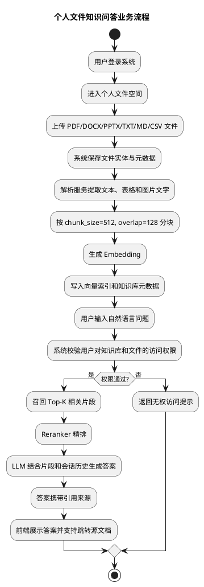

#### 2.3.2 团队协作与报告汇总流程

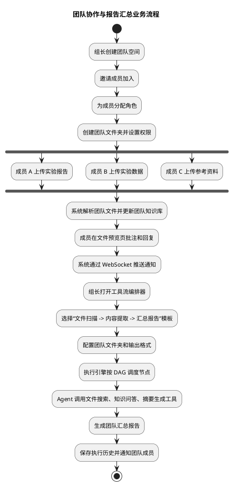

#### 2.3.3 管理员工具注册流程

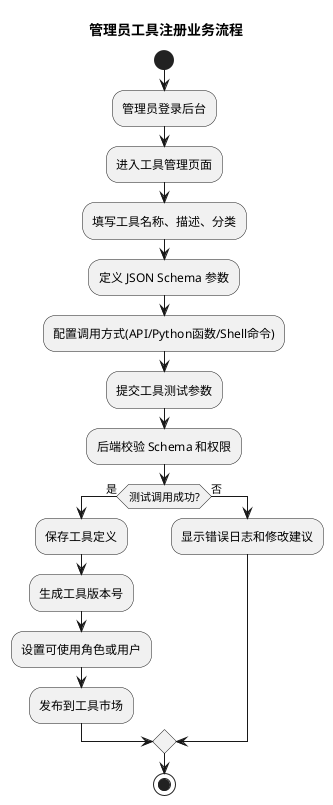

### 2.4 用户故事

#### 2.4.1 学生个人

| 编号   | User Story                                                                   | 验收标准                                                                                     |
| ------ | ---------------------------------------------------------------------------- | -------------------------------------------------------------------------------------------- |
| US-P01 | 作为学生个人，我希望上传课程资料并按文件夹分类，以便集中管理学习文件。       | 支持创建多级文件夹；上传后能看到文件名、类型、大小、上传时间；同名文件可提示覆盖或创建新版本 |
| US-P02 | 作为学生个人，我希望给文件添加标签并按标签筛选，以便快速定位资料。           | 支持手动创建、编辑、删除标签；支持按标签和文件类型组合过滤                                   |
| US-P03 | 作为学生个人，我希望系统自动解析上传的文档，以便之后可以用自然语言提问。     | PDF/DOCX/PPTX/TXT/MD/CSV 上传后进入解析队列；解析状态可见；解析失败有明确原因                |
| US-P04 | 作为学生个人，我希望询问“总结所有用到显微镜的实验步骤”，以便跨文件提炼知识。 | 系统返回结构化摘要；答案至少包含相关文件引用；无权限或无结果时给出清晰提示                   |
| US-P05 | 作为学生个人，我希望查看历史版本并回滚，以便恢复误修改的文件。               | 支持版本列表、版本下载、指定版本回滚；回滚后生成新版本记录                                   |

#### 2.4.2 课程小组成员

| 编号   | User Story                                                         | 验收标准                                                             |
| ------ | ------------------------------------------------------------------ | -------------------------------------------------------------------- |
| US-T01 | 作为组长，我希望创建团队并邀请成员，以便共享项目资料。             | 支持团队名称、描述、成员邀请链接或邀请记录；成员加入后可分配角色     |
| US-T02 | 作为团队成员，我希望上传文件到团队文件夹，以便小组共享实验数据。   | 只有有写权限的成员可以上传；上传后团队成员按权限可见                 |
| US-T03 | 作为团队成员，我希望在文件上批注并收到回复通知，以便围绕资料讨论。 | 支持批注、回复、删除自己的批注；被 @ 或收到回复时产生通知            |
| US-T04 | 作为组长，我希望执行团队周报生成流程，以便自动汇总小组进展。       | 可选择团队文件夹作为输入；执行过程可见；完成后生成报告并通知团队成员 |
| US-T05 | 作为团队成员，我希望聊天记录持久化，以便刷新页面后继续查看上下文。 | WebSocket 实时推送；刷新后可以加载历史消息；无权用户不能进入团队频道 |

#### 2.4.3 管理员

| 编号   | User Story                                                         | 验收标准                                                                    |
| ------ | ------------------------------------------------------------------ | --------------------------------------------------------------------------- |
| US-A01 | 作为系统管理员，我希望管理用户和角色，以便控制系统资源访问。       | 支持查看用户、禁用用户、分配系统角色；关键操作写入审计日志                  |
| US-A02 | 作为团队管理员，我希望设置文件夹和知识库权限，以便保护团队资料。   | 支持只读、读写、管理、不可见权限；子资源默认继承父权限；可单独覆盖          |
| US-A03 | 作为系统管理员，我希望注册工具并配置使用权限，以便扩展智能体能力。 | 支持工具 Schema、调用方式、版本、测试和权限配置；无权限用户不可见或不可执行 |
| US-A04 | 作为系统管理员，我希望查看工具流执行日志，以便排查失败原因。       | 支持按用户、流程、状态、时间过滤；节点输入输出和错误信息可追踪              |

### 2.5 功能需求清单

#### 2.5.1 用户与认证

| 编号   | 需求                                                                             | 优先级 |
| ------ | -------------------------------------------------------------------------------- | ------ |
| FR-U01 | 系统应支持用户注册，校验用户名、邮箱唯一性和密码强度。                           | 高     |
| FR-U02 | 系统应支持用户名/邮箱 + 密码登录，登录成功后签发 Access Token 和 Refresh Token。 | 高     |
| FR-U03 | 系统应对受保护 API 进行 JWT 鉴权，Token 无效或过期时拒绝访问。                   | 高     |
| FR-U04 | 系统应支持用户查看和修改个人基本资料。                                           | 中     |
| FR-U05 | 系统应记录登录失败次数，连续失败达到阈值后短期锁定账户。                         | 中     |

#### 2.5.2 文件管理

| 编号   | 需求                                                               | 优先级 |
| ------ | ------------------------------------------------------------------ | ------ |
| FR-F01 | 系统应支持文件上传、下载、删除、重命名、移动、复制。               | 高     |
| FR-F02 | 系统应支持文件夹创建、删除、移动、多级嵌套、树形导航和面包屑路径。 | 高     |
| FR-F03 | 系统应支持大文件分片上传和断点续传。                               | 高     |
| FR-F04 | 系统应保存文件 SHA256，用于完整性校验。                            | 高     |
| FR-F05 | 系统应支持文件版本控制，覆盖上传时自动生成新版本。                 | 高     |
| FR-F06 | 系统应支持手动标签和自动标签，并支持标签筛选。                     | 中     |
| FR-F07 | 系统应支持文件名全文搜索、标签筛选、文件类型过滤和时间范围过滤。   | 高     |
| FR-F08 | 系统应支持文件分享链接，可配置密码、过期时间和下载次数。           | 中     |
| FR-F09 | 系统应支持回收站或软删除，避免误删后无法恢复。                     | 中     |
| FR-F10 | 系统应支持元数据备份和文件存储异步备份。                           | 中     |

#### 2.5.3 知识库与 RAG 问答

| 编号   | 需求                                                                 | 优先级 |
| ------ | -------------------------------------------------------------------- | ------ |
| FR-K01 | 系统应支持创建、编辑、归档、删除知识库。                             | 高     |
| FR-K02 | 系统应支持 PDF、DOCX、PPTX、TXT、Markdown、CSV 文档解析。            | 高     |
| FR-K03 | 系统应支持图片文字 OCR 识别，并将识别结果纳入检索。                  | 中     |
| FR-K04 | 系统应按滑动窗口策略对文本分块，并保留文件、页码、段落位置等元数据。 | 高     |
| FR-K05 | 系统应调用 Embedding 模型生成向量并写入 FAISS/Milvus 索引。          | 高     |
| FR-K06 | 系统应支持自然语言语义检索，返回 Top-K 相关片段。                    | 高     |
| FR-K07 | 系统应支持 Reranker 精排，提高首位结果相关性。                       | 中     |
| FR-K08 | 系统应将检索片段、会话历史和系统提示词输入大模型生成答案。           | 高     |
| FR-K09 | 系统应以流式方式返回答案，并在答案中标注引用来源。                   | 高     |
| FR-K10 | 系统应支持多轮对话上下文窗口和会话历史查看。                         | 中     |

#### 2.5.4 智能体任务编排

| 编号   | 需求                                                                                                       | 优先级 |
| ------ | ---------------------------------------------------------------------------------------------------------- | ------ |
| FR-G01 | 系统应提供工具注册中心，统一保存工具名称、描述、参数 Schema、返回值 Schema 和调用方式。                    | 高     |
| FR-G02 | 系统应至少内置 file_search、knowledge_qa、image_ocr、file_compare、team_activity、report_generate 等工具。 | 高     |
| FR-G03 | 系统应支持 ReAct 执行流程：Thought、Action、Observation、Answer。                                          | 高     |
| FR-G04 | 系统应能够根据复杂任务拆分子任务并确定执行顺序。                                                           | 中     |
| FR-G05 | 系统应对工具调用进行参数校验、超时控制、失败重试和降级处理。                                               | 高     |
| FR-G06 | 系统应记录智能体执行步骤、工具调用参数、工具返回结果和最终答案。                                           | 高     |
| FR-G07 | 系统应在前端展示主要执行步骤和关键结果，提高透明度。                                                       | 中     |

#### 2.5.5 可视化工具流编排

| 编号   | 需求                                                               | 优先级 |
| ------ | ------------------------------------------------------------------ | ------ |
| FR-W01 | 系统应提供基于 Vue Flow 的拖拽式流程编辑器。                       | 高     |
| FR-W02 | 系统应支持工具节点、条件节点、循环节点、聚合节点和输出节点。       | 中     |
| FR-W03 | 系统应支持上游节点输出绑定到下游节点输入。                         | 高     |
| FR-W04 | 系统应保存流程定义，包括节点、连线、参数、触发方式和版本。         | 高     |
| FR-W05 | 系统应在保存或执行前校验 DAG，识别环、孤立节点和缺失参数。         | 高     |
| FR-W06 | 系统应支持流程模板，如新文件自动摘要、团队周报生成、文件内容比对。 | 中     |
| FR-W07 | 系统应支持单步调试，逐节点查看输入、输出、状态和错误。             | 中     |
| FR-W08 | 系统应通过 WebSocket 推送流程执行进度。                            | 高     |

#### 2.5.6 团队协作与权限

| 编号   | 需求                                                               | 优先级 |
| ------ | ------------------------------------------------------------------ | ------ |
| FR-C01 | 系统应支持创建团队、编辑团队信息、邀请成员和移除成员。             | 高     |
| FR-C02 | 系统应支持团队角色：团队管理员、成员、访客，并允许扩展自定义角色。 | 高     |
| FR-C03 | 系统应支持团队文件夹，团队文件与个人文件隔离。                     | 高     |
| FR-C04 | 系统应支持团队群聊和 1v1 私聊，消息实时推送并持久化。              | 中     |
| FR-C05 | 系统应支持文件批注和批注回复。                                     | 中     |
| FR-C06 | 系统应支持活动动态流，展示上传、删除、批注、执行流程等关键事件。   | 中     |
| FR-C07 | 系统应支持 @ 提醒、邀请通知、批注通知和流程完成通知。              | 中     |
| FR-C08 | 系统应支持资源级权限：不可见、只读、读写、管理。                   | 高     |
| FR-C09 | 系统应支持权限继承，文件夹权限默认继承到子文件和子文件夹。         | 高     |
| FR-C10 | 系统应支持操作审计，记录关键资源变更和权限变更。                   | 高     |

## 3. 需求分析建模

### 3.1 用例图

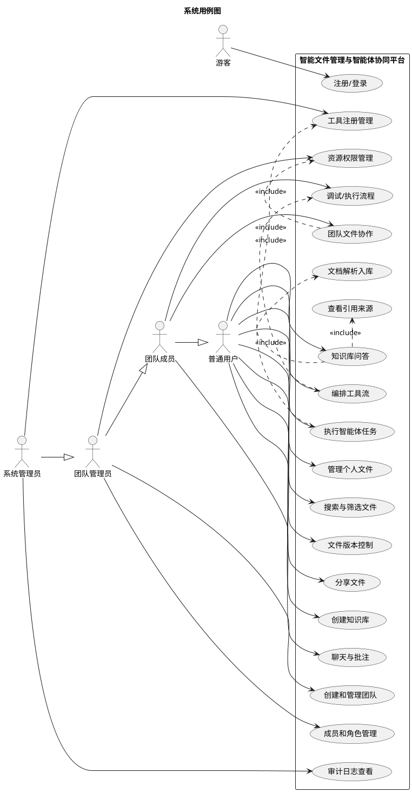

### 3.2 个人 RAG 问答时序图

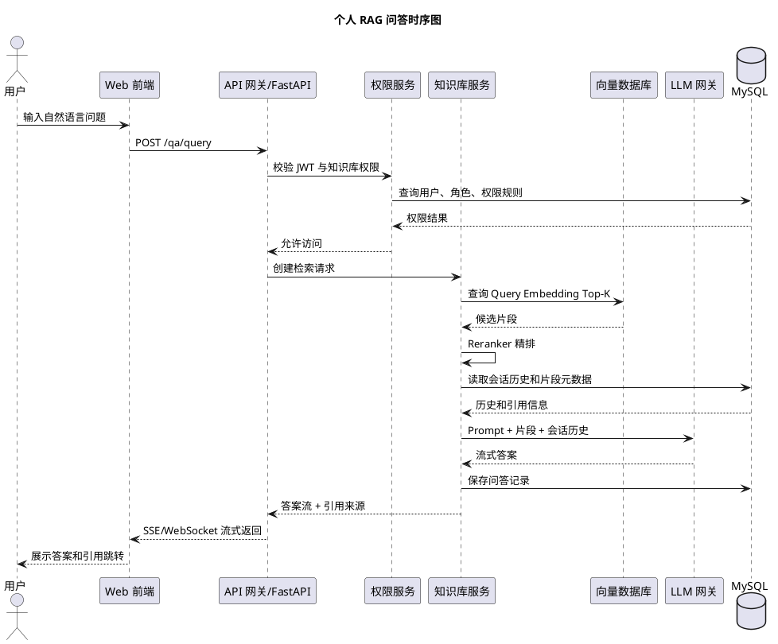

### 3.3 智能体工具调用时序图

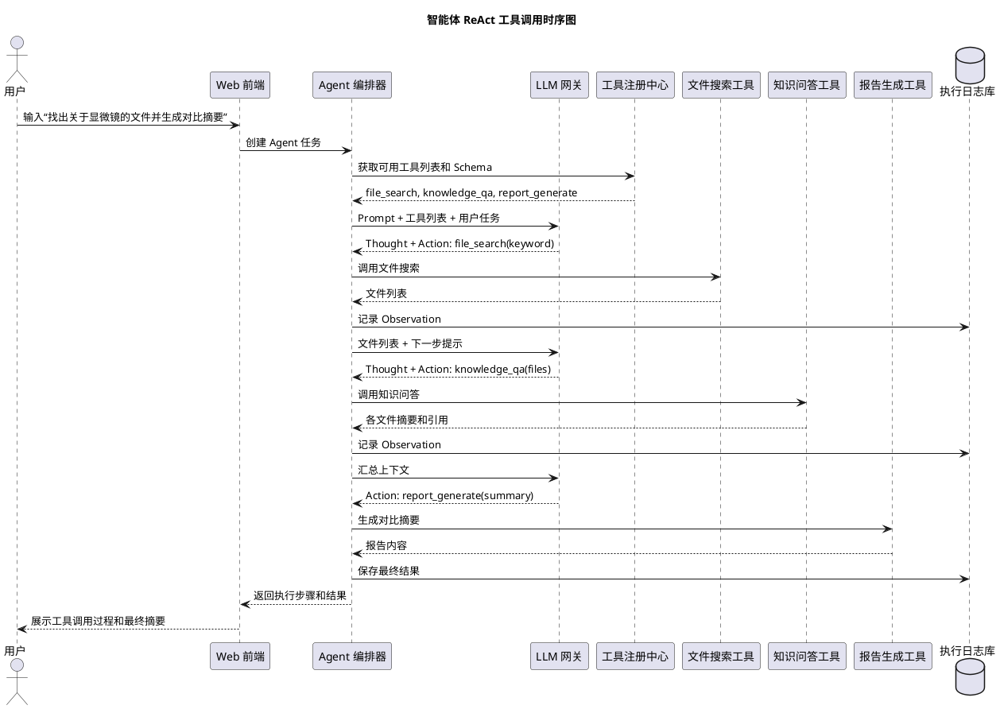

### 3.4 工具流执行活动图

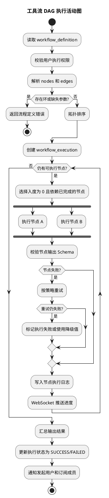

### 3.5 数据流图

#### 3.5.1 0 层数据流图

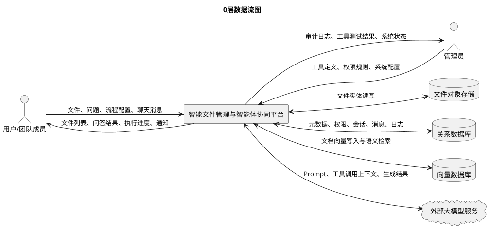

#### 3.5.2 1 层数据流图

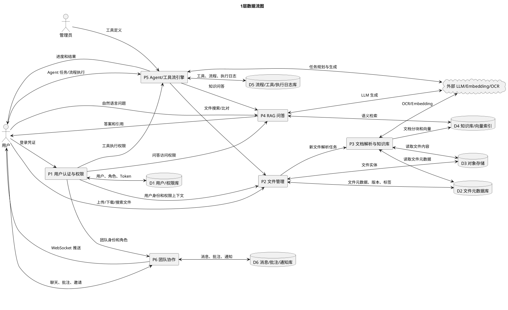

### 3.6 类图

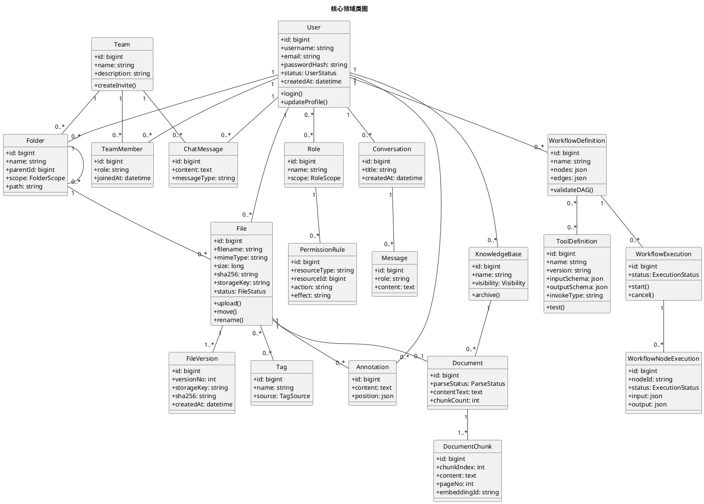

### 3.7 数据库概念设计 ER 图

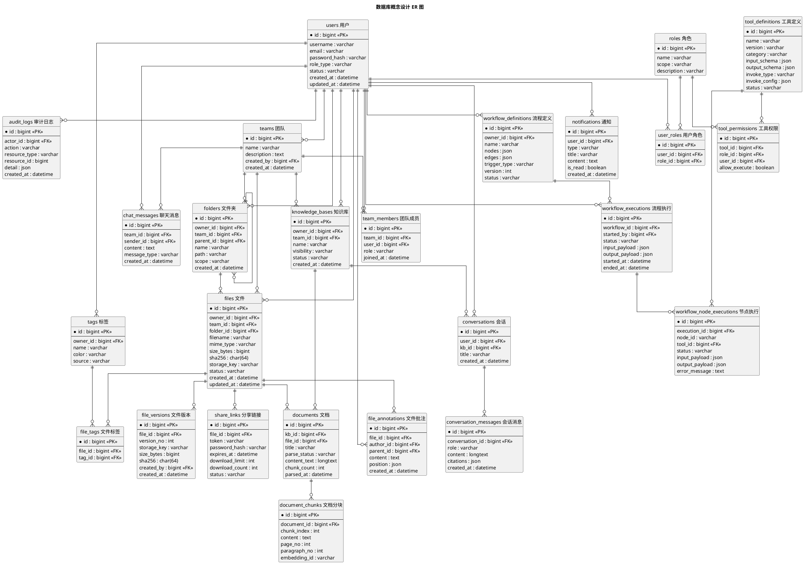

## 4. 数据字典

### 4.1 用户与权限域

#### users 用户表

| 字段          | 类型         | 约束             | 说明                           |
| ------------- | ------------ | ---------------- | ------------------------------ |
| id            | bigint       | PK               | 用户唯一编号                   |
| username      | varchar(64)  | unique, not null | 用户名                         |
| email         | varchar(128) | unique, not null | 邮箱                           |
| password_hash | varchar(255) | not null         | 密码哈希，使用 bcrypt/argon2   |
| role_type     | varchar(32)  | not null         | 系统角色，如 super_admin、user |
| status        | varchar(32)  | not null         | active、disabled、locked       |
| last_login_at | datetime     | nullable         | 最近登录时间                   |
| created_at    | datetime     | not null         | 创建时间                       |
| updated_at    | datetime     | not null         | 更新时间                       |

#### roles 角色表

| 字段        | 类型         | 约束     | 说明                 |
| ----------- | ------------ | -------- | -------------------- |
| id          | bigint       | PK       | 角色编号             |
| name        | varchar(64)  | not null | 角色名称             |
| scope       | varchar(32)  | not null | system、team、custom |
| description | varchar(255) | nullable | 角色说明             |
| created_at  | datetime     | not null | 创建时间             |

#### user_roles 用户角色关联表

| 字段       | 类型     | 约束        | 说明     |
| ---------- | -------- | ----------- | -------- |
| id         | bigint   | PK          | 关联编号 |
| user_id    | bigint   | FK users.id | 用户编号 |
| role_id    | bigint   | FK roles.id | 角色编号 |
| created_at | datetime | not null    | 授权时间 |

#### permission_rules 权限规则表

| 字段          | 类型        | 约束     | 说明                                         |
| ------------- | ----------- | -------- | -------------------------------------------- |
| id            | bigint      | PK       | 权限规则编号                                 |
| subject_type  | varchar(32) | not null | user、role、team                             |
| subject_id    | bigint      | not null | 授权主体编号                                 |
| resource_type | varchar(32) | not null | file、folder、knowledge_base、tool、workflow |
| resource_id   | bigint      | not null | 资源编号                                     |
| action        | varchar(32) | not null | read、write、delete、manage、execute         |
| effect        | varchar(16) | not null | allow、deny                                  |
| inherit       | boolean     | not null | 是否向下继承                                 |
| created_at    | datetime    | not null | 创建时间                                     |

### 4.2 团队协作域

#### teams 团队表

| 字段        | 类型         | 约束        | 说明     |
| ----------- | ------------ | ----------- | -------- |
| id          | bigint       | PK          | 团队编号 |
| name        | varchar(128) | not null    | 团队名称 |
| description | text         | nullable    | 团队说明 |
| created_by  | bigint       | FK users.id | 创建者   |
| created_at  | datetime     | not null    | 创建时间 |
| updated_at  | datetime     | not null    | 更新时间 |

#### team_members 团队成员表

| 字段      | 类型        | 约束        | 说明                        |
| --------- | ----------- | ----------- | --------------------------- |
| id        | bigint      | PK          | 成员记录编号                |
| team_id   | bigint      | FK teams.id | 团队编号                    |
| user_id   | bigint      | FK users.id | 用户编号                    |
| role      | varchar(32) | not null    | owner、admin、member、guest |
| status    | varchar(32) | not null    | active、invited、removed    |
| joined_at | datetime    | nullable    | 加入时间                    |

#### chat_messages 聊天消息表

| 字段         | 类型        | 约束                  | 说明                 |
| ------------ | ----------- | --------------------- | -------------------- |
| id           | bigint      | PK                    | 消息编号             |
| team_id      | bigint      | FK teams.id           | 所属团队             |
| sender_id    | bigint      | FK users.id           | 发送者               |
| receiver_id  | bigint      | FK users.id, nullable | 私聊接收者，群聊为空 |
| content      | text        | not null              | 消息内容             |
| message_type | varchar(32) | not null              | text、file、system   |
| created_at   | datetime    | not null              | 发送时间             |

#### file_annotations 文件批注表

| 字段       | 类型     | 约束                             | 说明                           |
| ---------- | -------- | -------------------------------- | ------------------------------ |
| id         | bigint   | PK                               | 批注编号                       |
| file_id    | bigint   | FK files.id                      | 文件编号                       |
| author_id  | bigint   | FK users.id                      | 作者                           |
| parent_id  | bigint   | FK file_annotations.id, nullable | 父批注，用于回复               |
| content    | text     | not null                         | 批注内容                       |
| position   | json     | nullable                         | 页码、坐标、选中文本等定位信息 |
| created_at | datetime | not null                         | 创建时间                       |
| updated_at | datetime | not null                         | 更新时间                       |

#### notifications 通知表

| 字段        | 类型         | 约束        | 说明                                          |
| ----------- | ------------ | ----------- | --------------------------------------------- |
| id          | bigint       | PK          | 通知编号                                      |
| user_id     | bigint       | FK users.id | 接收用户                                      |
| type        | varchar(32)  | not null    | invite、mention、annotation、workflow、system |
| title       | varchar(128) | not null    | 通知标题                                      |
| content     | text         | nullable    | 通知正文                                      |
| target_type | varchar(32)  | nullable    | 跳转目标类型                                  |
| target_id   | bigint       | nullable    | 跳转目标编号                                  |
| is_read     | boolean      | not null    | 是否已读                                      |
| created_at  | datetime     | not null    | 创建时间                                      |

### 4.3 文件管理域

#### folders 文件夹表

| 字段       | 类型          | 约束                    | 说明               |
| ---------- | ------------- | ----------------------- | ------------------ |
| id         | bigint        | PK                      | 文件夹编号         |
| owner_id   | bigint        | FK users.id, nullable   | 个人文件夹所属用户 |
| team_id    | bigint        | FK teams.id, nullable   | 团队文件夹所属团队 |
| parent_id  | bigint        | FK folders.id, nullable | 父文件夹           |
| name       | varchar(128)  | not null                | 文件夹名称         |
| path       | varchar(1024) | not null                | 规范化路径         |
| scope      | varchar(32)   | not null                | personal、team     |
| created_at | datetime      | not null                | 创建时间           |
| updated_at | datetime      | not null                | 更新时间           |

#### files 文件表

| 字段        | 类型         | 约束                  | 说明                                |
| ----------- | ------------ | --------------------- | ----------------------------------- |
| id          | bigint       | PK                    | 文件编号                            |
| owner_id    | bigint       | FK users.id, nullable | 个人文件所有者                      |
| team_id     | bigint       | FK teams.id, nullable | 团队文件所属团队                    |
| folder_id   | bigint       | FK folders.id         | 所属文件夹                          |
| filename    | varchar(255) | not null              | 展示文件名                          |
| extension   | varchar(32)  | nullable              | 文件扩展名                          |
| mime_type   | varchar(128) | not null              | MIME 类型                           |
| size_bytes  | bigint       | not null              | 文件大小                            |
| sha256      | char(64)     | not null              | 文件内容哈希                        |
| storage_key | varchar(512) | not null              | 对象存储路径                        |
| status      | varchar(32)  | not null              | active、deleted、processing、failed |
| sensitive   | boolean      | not null              | 是否敏感文件                        |
| created_at  | datetime     | not null              | 创建时间                            |
| updated_at  | datetime     | not null              | 更新时间                            |

#### file_versions 文件版本表

| 字段        | 类型         | 约束        | 说明             |
| ----------- | ------------ | ----------- | ---------------- |
| id          | bigint       | PK          | 版本编号         |
| file_id     | bigint       | FK files.id | 文件编号         |
| version_no  | int          | not null    | 版本号           |
| storage_key | varchar(512) | not null    | 版本文件存储路径 |
| size_bytes  | bigint       | not null    | 版本文件大小     |
| sha256      | char(64)     | not null    | 版本文件哈希     |
| created_by  | bigint       | FK users.id | 创建者           |
| created_at  | datetime     | not null    | 创建时间         |

#### tags 标签表

| 字段       | 类型        | 约束                  | 说明         |
| ---------- | ----------- | --------------------- | ------------ |
| id         | bigint      | PK                    | 标签编号     |
| owner_id   | bigint      | FK users.id, nullable | 标签创建者   |
| name       | varchar(64) | not null              | 标签名称     |
| color      | varchar(16) | nullable              | 展示颜色     |
| source     | varchar(32) | not null              | manual、auto |
| created_at | datetime    | not null              | 创建时间     |

#### file_tags 文件标签关联表

| 字段       | 类型     | 约束        | 说明     |
| ---------- | -------- | ----------- | -------- |
| id         | bigint   | PK          | 关联编号 |
| file_id    | bigint   | FK files.id | 文件编号 |
| tag_id     | bigint   | FK tags.id  | 标签编号 |
| created_at | datetime | not null    | 创建时间 |

#### share_links 分享链接表

| 字段           | 类型         | 约束             | 说明                      |
| -------------- | ------------ | ---------------- | ------------------------- |
| id             | bigint       | PK               | 分享编号                  |
| file_id        | bigint       | FK files.id      | 文件编号                  |
| token          | varchar(128) | unique, not null | 分享令牌                  |
| password_hash  | varchar(255) | nullable         | 访问密码哈希              |
| expires_at     | datetime     | nullable         | 过期时间                  |
| download_limit | int          | nullable         | 下载次数上限              |
| download_count | int          | not null         | 已下载次数                |
| status         | varchar(32)  | not null         | active、expired、disabled |
| created_at     | datetime     | not null         | 创建时间                  |

### 4.4 知识库与问答域

#### knowledge_bases 知识库表

| 字段        | 类型         | 约束                  | 说明                      |
| ----------- | ------------ | --------------------- | ------------------------- |
| id          | bigint       | PK                    | 知识库编号                |
| owner_id    | bigint       | FK users.id           | 创建者                    |
| team_id     | bigint       | FK teams.id, nullable | 团队知识库所属团队        |
| name        | varchar(128) | not null              | 知识库名称                |
| description | text         | nullable              | 说明                      |
| visibility  | varchar(32)  | not null              | private、team、public     |
| status      | varchar(32)  | not null              | active、archived、deleted |
| created_at  | datetime     | not null              | 创建时间                  |
| updated_at  | datetime     | not null              | 更新时间                  |

#### documents 文档表

| 字段           | 类型         | 约束                  | 说明                                 |
| -------------- | ------------ | --------------------- | ------------------------------------ |
| id             | bigint       | PK                    | 文档编号                             |
| kb_id          | bigint       | FK knowledge_bases.id | 知识库编号                           |
| file_id        | bigint       | FK files.id           | 来源文件                             |
| title          | varchar(255) | not null              | 文档标题                             |
| parse_status   | varchar(32)  | not null              | pending、processing、success、failed |
| content_text   | longtext     | nullable              | 解析后的全文                         |
| chunk_count    | int          | not null              | 分块数量                             |
| parser_version | varchar(32)  | nullable              | 解析器版本                           |
| parsed_at      | datetime     | nullable              | 解析完成时间                         |

#### document_chunks 文档分块表

| 字段         | 类型         | 约束            | 说明                   |
| ------------ | ------------ | --------------- | ---------------------- |
| id           | bigint       | PK              | 分块编号               |
| document_id  | bigint       | FK documents.id | 文档编号               |
| chunk_index  | int          | not null        | 分块序号               |
| content      | text         | not null        | 分块文本               |
| page_no      | int          | nullable        | 页码                   |
| paragraph_no | int          | nullable        | 段落号                 |
| start_offset | int          | nullable        | 起始字符偏移           |
| end_offset   | int          | nullable        | 结束字符偏移           |
| embedding_id | varchar(128) | not null        | 向量数据库中的向量编号 |

#### conversations 会话表

| 字段       | 类型         | 约束                            | 说明       |
| ---------- | ------------ | ------------------------------- | ---------- |
| id         | bigint       | PK                              | 会话编号   |
| user_id    | bigint       | FK users.id                     | 发起用户   |
| kb_id      | bigint       | FK knowledge_bases.id, nullable | 关联知识库 |
| title      | varchar(255) | nullable                        | 会话标题   |
| created_at | datetime     | not null                        | 创建时间   |
| updated_at | datetime     | not null                        | 更新时间   |

#### conversation_messages 会话消息表

| 字段            | 类型        | 约束                | 说明                          |
| --------------- | ----------- | ------------------- | ----------------------------- |
| id              | bigint      | PK                  | 消息编号                      |
| conversation_id | bigint      | FK conversations.id | 会话编号                      |
| role            | varchar(32) | not null            | user、assistant、system、tool |
| content         | longtext    | not null            | 消息内容                      |
| citations       | json        | nullable            | 引用来源列表                  |
| token_count     | int         | nullable            | Token 数                      |
| created_at      | datetime    | not null            | 创建时间                      |

### 4.5 工具流与智能体域

#### tool_definitions 工具定义表

| 字段            | 类型         | 约束        | 说明                               |
| --------------- | ------------ | ----------- | ---------------------------------- |
| id              | bigint       | PK          | 工具编号                           |
| name            | varchar(128) | not null    | 工具名称                           |
| version         | varchar(32)  | not null    | 工具版本                           |
| category        | varchar(64)  | not null    | 文件操作、AI处理、数据分析、通知等 |
| description     | text         | nullable    | 工具说明                           |
| input_schema    | json         | not null    | 输入参数 JSON Schema               |
| output_schema   | json         | not null    | 输出结果 JSON Schema               |
| invoke_type     | varchar(32)  | not null    | api、python、shell                 |
| invoke_config   | json         | not null    | 调用地址、函数名或命令配置         |
| timeout_seconds | int          | not null    | 超时时间，默认不超过 30 秒         |
| status          | varchar(32)  | not null    | draft、active、disabled            |
| created_by      | bigint       | FK users.id | 创建者                             |
| created_at      | datetime     | not null    | 创建时间                           |

#### tool_permissions 工具权限表

| 字段          | 类型     | 约束                   | 说明         |
| ------------- | -------- | ---------------------- | ------------ |
| id            | bigint   | PK                     | 权限编号     |
| tool_id       | bigint   | FK tool_definitions.id | 工具编号     |
| role_id       | bigint   | FK roles.id, nullable  | 被授权角色   |
| user_id       | bigint   | FK users.id, nullable  | 被授权用户   |
| allow_execute | boolean  | not null               | 是否允许执行 |
| created_at    | datetime | not null               | 创建时间     |

#### workflow_definitions 流程定义表

| 字段         | 类型         | 约束                  | 说明                       |
| ------------ | ------------ | --------------------- | -------------------------- |
| id           | bigint       | PK                    | 流程编号                   |
| owner_id     | bigint       | FK users.id           | 创建者                     |
| team_id      | bigint       | FK teams.id, nullable | 团队流程所属团队           |
| name         | varchar(128) | not null              | 流程名称                   |
| description  | text         | nullable              | 流程说明                   |
| nodes        | json         | not null              | 节点定义                   |
| edges        | json         | not null              | 连线定义                   |
| trigger_type | varchar(32)  | not null              | manual、event、schedule    |
| version      | int          | not null              | 流程版本                   |
| status       | varchar(32)  | not null              | draft、published、archived |
| created_at   | datetime     | not null              | 创建时间                   |

#### workflow_executions 流程执行表

| 字段           | 类型        | 约束                       | 说明                                         |
| -------------- | ----------- | -------------------------- | -------------------------------------------- |
| id             | bigint      | PK                         | 执行编号                                     |
| workflow_id    | bigint      | FK workflow_definitions.id | 流程编号                                     |
| started_by     | bigint      | FK users.id                | 发起用户                                     |
| status         | varchar(32) | not null                   | pending、running、success、failed、cancelled |
| input_payload  | json        | nullable                   | 执行输入                                     |
| output_payload | json        | nullable                   | 执行输出                                     |
| error_message  | text        | nullable                   | 失败原因                                     |
| started_at     | datetime    | not null                   | 开始时间                                     |
| ended_at       | datetime    | nullable                   | 结束时间                                     |

#### workflow_node_executions 节点执行表

| 字段           | 类型        | 约束                             | 说明                                       |
| -------------- | ----------- | -------------------------------- | ------------------------------------------ |
| id             | bigint      | PK                               | 节点执行编号                               |
| execution_id   | bigint      | FK workflow_executions.id        | 流程执行编号                               |
| node_id        | varchar(64) | not null                         | 前端流程节点 ID                            |
| tool_id        | bigint      | FK tool_definitions.id, nullable | 绑定工具                                   |
| status         | varchar(32) | not null                         | pending、running、success、failed、skipped |
| input_payload  | json        | nullable                         | 节点输入                                   |
| output_payload | json        | nullable                         | 节点输出                                   |
| retry_count    | int         | not null                         | 已重试次数                                 |
| error_message  | text        | nullable                         | 错误信息                                   |
| started_at     | datetime    | nullable                         | 开始时间                                   |
| ended_at       | datetime    | nullable                         | 结束时间                                   |

### 4.6 审计与活动域

#### team_activities 团队动态表

| 字段          | 类型        | 约束        | 说明                                 |
| ------------- | ----------- | ----------- | ------------------------------------ |
| id            | bigint      | PK          | 动态编号                             |
| team_id       | bigint      | FK teams.id | 团队编号                             |
| actor_id      | bigint      | FK users.id | 操作者                               |
| activity_type | varchar(64) | not null    | upload、delete、comment、workflow 等 |
| target_type   | varchar(32) | not null    | file、folder、workflow、member       |
| target_id     | bigint      | not null    | 目标资源编号                         |
| detail        | json        | nullable    | 详情                                 |
| created_at    | datetime    | not null    | 创建时间                             |

#### audit_logs 审计日志表

| 字段          | 类型         | 约束                  | 说明         |
| ------------- | ------------ | --------------------- | ------------ |
| id            | bigint       | PK                    | 审计日志编号 |
| actor_id      | bigint       | FK users.id, nullable | 操作者       |
| action        | varchar(64)  | not null              | 操作类型     |
| resource_type | varchar(32)  | not null              | 资源类型     |
| resource_id   | bigint       | nullable              | 资源编号     |
| ip_address    | varchar(64)  | nullable              | 请求 IP      |
| user_agent    | varchar(255) | nullable              | 客户端信息   |
| detail        | json         | nullable              | 操作详情     |
| created_at    | datetime     | not null              | 创建时间     |

## 5. 非功能性需求说明

### 5.1 性能需求

| 编号    | 需求                                                                                                                     |
| ------- | ------------------------------------------------------------------------------------------------------------------------ |
| NFR-P01 | 文件列表、搜索、权限校验等普通 API 在正常负载下平均响应时间不超过 500ms。                                                |
| NFR-P02 | 10 个并发 10MB 文件上传和 5 个并发问答请求时，核心业务平均响应时间不超过 3s；问答可采用流式输出，首字响应时间不超过 5s。 |
| NFR-P03 | 50 个 WebSocket 连接同时在线时，聊天和流程进度消息端到端延迟不超过 500ms。                                               |
| NFR-P04 | 单个工具调用默认超时时间不超过 30s，超时后进入重试或降级流程。                                                           |
| NFR-P05 | 文档解析和向量化采用异步任务，不能阻塞文件上传主流程。                                                                   |

### 5.2 可靠性与可用性需求

| 编号    | 需求                                                                                     |
| ------- | ---------------------------------------------------------------------------------------- |
| NFR-R01 | 系统应支持 24 小时连续运行，内存增长小于 10%。                                           |
| NFR-R02 | WebSocket 长连接应支持断线重连，重连后补推未读消息或最新流程状态。                       |
| NFR-R03 | 文件上传应支持断点续传和分片校验，网络中断后可以恢复上传状态。                           |
| NFR-R04 | LLM API 不可用时，系统应返回明确降级提示，已完成的文件管理、搜索和团队协作功能不受影响。 |
| NFR-R05 | 数据库和文件对象存储应支持定期备份，备份失败写入告警日志。                               |

### 5.3 安全需求

| 编号    | 需求                                                                             |
| ------- | -------------------------------------------------------------------------------- |
| NFR-S01 | 全站生产环境应强制 HTTPS，HTTP 请求重定向至 HTTPS。                              |
| NFR-S02 | 密码不得明文存储，必须使用 bcrypt 或 argon2 哈希。                               |
| NFR-S03 | 所有受保护 API 和 WebSocket 建连必须校验 JWT。                                   |
| NFR-S04 | 权限中间件必须在文件、知识库、工具、流程和团队资源访问前执行。                   |
| NFR-S05 | 文件下载链接使用短期签名链接，有效期不超过 1 小时。                              |
| NFR-S06 | 上传文件必须进行扩展名、MIME、大小、路径穿越和 SHA256 校验。                     |
| NFR-S07 | 文件名、标签、聊天消息、批注、工具描述等用户输入在前端渲染时必须转义，防止 XSS。 |
| NFR-S08 | 状态变更请求应具备 CSRF 防护或使用安全的 Token 机制。                            |
| NFR-S09 | 管理员操作、权限变更、文件删除、分享创建和工具执行必须写入审计日志。             |

### 5.4 易用性需求

| 编号    | 需求                                                                       |
| ------- | -------------------------------------------------------------------------- |
| NFR-U01 | 文件管理界面应提供树形导航、面包屑、搜索框、筛选器和批量操作。             |
| NFR-U02 | RAG 问答界面应清晰展示答案、引用来源和流式生成状态。                       |
| NFR-U03 | 工具流编辑器应支持拖拽、连线、节点配置、错误提示和单步调试。               |
| NFR-U04 | 执行智能体任务时应展示主要工具调用步骤和当前状态，避免用户认为系统无响应。 |
| NFR-U05 | 错误提示应可读，说明失败原因和用户可采取的下一步。                         |

### 5.5 兼容性需求

| 编号    | 需求                                                               |
| ------- | ------------------------------------------------------------------ |
| NFR-C01 | 前端应兼容 Chrome 120+、Edge 120+、Firefox 120+。                  |
| NFR-C02 | 后端应支持 Ubuntu 22.04+ 和 macOS 14+ 开发运行环境。               |
| NFR-C03 | 系统应支持主流桌面分辨率，并对平板和手机浏览器进行基础响应式适配。 |

### 5.6 可维护性与可扩展性需求

| 编号    | 需求                                                                             |
| ------- | -------------------------------------------------------------------------------- |
| NFR-M01 | 后端应按用户认证、文件管理、知识库、智能体、工具流、团队协作、权限审计划分模块。 |
| NFR-M02 | 工具定义应通过 Schema 和调用配置扩展，新增工具不应修改 Agent 核心执行逻辑。      |
| NFR-M03 | 向量数据库应支持从 FAISS 平滑扩展到 Milvus。                                     |
| NFR-M04 | 关键配置如 LLM API Key、数据库连接、对象存储连接必须通过环境变量注入。           |
| NFR-M05 | 代码应使用 Git 版本控制，提交前通过单元测试和静态检查。                          |

## 6. 系统开发环境、运行环境与依赖项

### 6.1 开发环境

| 类别         | 选型                                  |
| ------------ | ------------------------------------- |
| 操作系统     | Zorin 17.3(Ubuntu 22.04) / Windows 11 |
| 版本控制     | Git                                   |
| 后端语言     | Python 3.13+                          |
| 后端框架     | FastAPI                               |
| 前端语言     | TypeScript / JavaScript               |
| 前端框架     | Vue 3 + Vite                          |
| UI 组件      | Naive UI                              |
| 状态管理     | Pinia                                 |
| 路由         | Vue Router                            |
| 工具流可视化 | Vue Flow                              |
| 数据库       | MySQL 8.0                             |
| 对象存储     | MinIO 或本地文件系统                  |
| 向量数据库   | FAISS，后期可扩展 Milvus              |
| 大模型编排   | LangChain + LangGraph                 |
| 测试         | pytest、Vitest、Playwright            |

### 6.2 运行环境

| 组件       | 要求                                 |
| ---------- | ------------------------------------ |
| Web 前端   | 通过 Nginx 或 Vite 构建产物静态部署  |
| 后端 API   | FastAPI + Uvicorn/Gunicorn           |
| 关系数据库 | MySQL 8.0，独立数据库实例            |
| 文件存储   | MinIO Bucket 或本地挂载目录          |
| 向量索引   | FAISS 本地索引文件或 Milvus 服务     |
| 异步任务   | 后端后台任务，扩展时可接入 Celery/RQ |
| 实时通信   | WebSocket 服务                       |
| HTTPS      | Nginx/反向代理负责 TLS 终止          |

### 6.3 系统依赖项

#### 后端依赖

| 依赖                              | 用途                              |
| --------------------------------- | --------------------------------- |
| FastAPI                           | REST API 和 WebSocket 服务        |
| Uvicorn                           | ASGI 运行服务器                   |
| SQLAlchemy                        | ORM 数据访问                      |
| Alembic                           | 数据库迁移                        |
| PyMySQL                           | MySQL 驱动                        |
| PyJWT                             | JWT 生成和校验                    |
| passlib[bcrypt]                   | 密码哈希                          |
| pydantic                          | 请求和响应模型校验                |
| minio / boto3                     | 对象存储访问                      |
| langchain                         | RAG 和工具调用封装                |
| langgraph                         | Agent 状态图和多步骤编排          |
| faiss-cpu                         | 向量索引                          |
| sentence-transformers             | BGE-M3 或 text2vec Embedding 调用 |
| PaddleOCR                         | 图片文字识别                      |
| python-docx / pypdf / python-pptx | 文档解析                          |
| pytest                            | 后端单元测试                      |

#### 前端依赖

| 依赖          | 用途               |
| ------------- | ------------------ |
| Vue 3         | 前端框架           |
| Vite          | 构建工具           |
| TypeScript    | 类型约束           |
| Naive UI      | UI 组件库          |
| Pinia         | 全局状态管理       |
| Vue Router    | 前端路由           |
| Vue Flow      | 工具流可视化编辑器 |
| Axios         | HTTP 请求          |
| WebSocket API | 实时聊天和进度推送 |
| Vitest        | 单元测试           |
| Playwright    | 端到端测试         |

#### 外部服务依赖

| 服务                         | 用途                         | 降级策略                            |
| ---------------------------- | ---------------------------- | ----------------------------------- |
| DeepSeek API 或兼容 LLM API  | 问答生成、任务规划、摘要生成 | 返回明确提示；文件管理和搜索仍可用  |
| Embedding 模型服务或本地模型 | 文档向量化和语义检索         | 暂停新文档入库，保留已有索引检索    |
| OCR 模型                     | 图片和扫描件文字提取         | 标记 OCR 失败，保留文件基本管理能力 |
| MinIO 服务                   | 文件对象存储                 | 本地文件系统作为开发环境替代        |

### 6.4 环境变量

| 环境变量           | 说明                  |
| ------------------ | --------------------- |
| DATABASE_URL       | MySQL 连接地址        |
| JWT_SECRET_KEY     | JWT 签名密钥          |
| JWT_EXPIRE_MINUTES | Access Token 过期时间 |
| MINIO_ENDPOINT     | MinIO 服务地址        |
| MINIO_ACCESS_KEY   | MinIO 访问 Key        |
| MINIO_SECRET_KEY   | MinIO 密钥            |
| MINIO_BUCKET       | 文件 Bucket           |
| LLM_API_KEY        | 大模型 API Key        |
| LLM_BASE_URL       | 大模型 API 地址       |
| EMBEDDING_MODEL    | Embedding 模型名称    |
| VECTOR_STORE_PATH  | FAISS 索引文件路径    |

## 7. 需求优先级与验收指标

### 7.1 MVP 范围

1. 用户注册、登录、JWT 鉴权。
2. 个人文件和文件夹基础 CRUD。
3. 文件上传、下载、删除、搜索和标签筛选。
4. PDF/DOCX/PPTX/TXT/MD/CSV 基础解析。
5. 知识库创建、文档分块、向量索引和自然语言问答。
6. 基础团队创建、成员邀请、团队文件夹和角色权限。
7. 至少 3 个工具的智能体调用：文件搜索、知识问答、报告生成。
8. 至少 1 个可运行工具流模板：新文件自动摘要。

### 7.2 完整验收指标

| 类别       | 指标                                                                                        |
| ---------- | ------------------------------------------------------------------------------------------- |
| 功能完整性 | 覆盖文件管理、RAG 问答、智能体、工具流、团队协作、权限审计六类核心功能                      |
| 智能体测试 | 不少于 10 条测试用例，覆盖直接回答、单工具、多工具、多轮对话、错误输入和权限拒绝            |
| RAG 质量   | 不少于 20 条领域问题，人工评分相关性和准确性均分不低于 3.5/5                                |
| 工具流验收 | 不少于 5 个流程模板，包括新文件自动摘要、图像批量标注、团队周报生成、文件内容比对、数据导出 |
| 安全验收   | 越权访问返回 403；无 Token 返回 401；上传绕过、XSS、路径穿越用例被拦截                      |
| 性能验收   | 10 个并发上传 + 5 个并发问答平均响应时间不超过 3s；50 个 WebSocket 连接消息延迟不超过 500ms |

## 8. 需求追踪矩阵

| 业务目标           | 对应功能需求                         | 对应模型                          |
| ------------------ | ------------------------------------ | --------------------------------- |
| 文件全生命周期管理 | FR-F01 至 FR-F10                     | 业务流程图、类图、ER 图、数据字典 |
| 自然语言知识问答   | FR-K01 至 FR-K10                     | RAG 时序图、数据流图、类图、ER 图 |
| 智能体任务编排     | FR-G01 至 FR-G07                     | Agent 时序图、工具流活动图、类图  |
| 可视化工具流       | FR-W01 至 FR-W08                     | 工具流活动图、类图、ER 图         |
| 团队协作           | FR-C01 至 FR-C07                     | 团队业务流程、用例图、ER 图       |
| 权限与安全         | FR-C08 至 FR-C10、NFR-S01 至 NFR-S09 | 用例图、数据流图、ER 图、数据字典 |
